# 支払い・予約フロー（To-Be 統合版）— PEDALSTANDARD × 販売店 × Bubble × Pay.jp

**PEDALSTANDARD** は RINCLE の**運営者**。**販売店（加盟店）**は在庫・店頭対応・予約確定の当事者。  
本文書は、ビジネスルール（To-Be）と **Bubble DB / Pay.jp API** の対応を**一本化**したもの。現行 Bubble の実装が異なる場合は、**To-Be に合わせて修正対象**とする。

---

## 1. To-Be サマリー（金の流れ）

| 項目 | To-Be |
|------|--------|
| カード決済の売上の帰属 | **販売店**が Pay.jp から**ネット入金**を受ける（イメージ: **カード利用料約 3.5% 相当を差し引いた後**）。 |
| プラットフォーム利用料 | **売上の 15%** は **PEDALSTANDARD への支払い**とし、原則 **毎月末請求**（Pay.jp の都度 `platform_fee` で抜く形にしない／または抜かない設計）。 |
| 予約確定 | **販売店側が予約を確定する**フローが前提（運営のみの自動確定ではない）。 |
| 現地払い | クレジットと**別ルート**。来店時精算。 |
| 延長 | **実績ゼロ**。**動作未検証**のため To-Be に組み込む前に検証必須。 |

**エラー時フロー図（本文中の位置）**

| 節 | 内容 |
|----|------|
| §3.0 | 論理状態・Pay.jp・Bubble（申込〜確定） |
| §3.1.1 | トークン失敗・オーソリ失敗・タイムアウト |
| §4.5 | 返金／解放 API 失敗、DB と Pay.jp の順序 |
| §5.0 | 論理状態・Pay.jp・Bubble（キャプチャ当日） |
| §5.1 | キャプチャ拒否・期限切れ・別カード・店頭フォールバック |
| §6.0 | Webhook と Bubble 更新・フィールド例 |
| §6.2 | Webhook 署名失敗・テナント不一致・failed イベント |

---

## 2. 現状の懸念：Bubble／Pay.jp 設定ミスと「テナントに払われてしまう」

Pay.jp **Platform** では `POST /v1/charges` に **`tenant`**（販売店のテナント ID）や **`platform_fee`** 等を付与する。ここが Bubble 上の API Connector／ワークフローと**矛盾**すると、次のような不整合が起きうる。

| 誤りパターン（推測） | 起きうる結果 |
|----------------------|----------------|
| **`tenant` が販売店ではなく運営側・別 ID になっている** | 売上の**入金先が意図した販売店とずれる**（「テナントに払われてしまう」表現の正体の一つ）。 |
| **`platform_fee` が大きすぎる／運営へ寄る設定** | 都度、**運営側に手数料が積み上がる**（従来整理されていた **10% が PEDALSTANDARD に入る**に近い見え方）。 |
| **プラットフォーム用シークレットとテナントの組み合わせ誤り** | ダッシュボード上の入金・レポートと Bubble が保存する `charge_id` の解釈がずれる。 |

**To-Be で求める設定方針（概念）:**

- カード売上の **Pay.jp 上の入金先（テナント）は「その予約の販売店」** と一致させる。
- **15% の回収**は、原則 **Pay.jp の都度手数料として運営に送金**ではなく、**請求書・別契約での月末請求**で回す（都度 `platform_fee` で 15% を抜く設計にする場合は、会計・表示・契約と**明示的に一致**させる）。

> 実際のパラメータ名・可否は [PAY.JP Platform](https://pay.jp/v1/platform-introduction) と契約プランに従う。

**Bubble との対応（論理状態・フィールド）**は **§3.0**（申込〜確定）、**§4**（キャンセル）、**§5.0**（キャプチャ）、**§6.0**（Webhook）、横断一覧 **§9** に集約する。

---

## 3. 統合フロー（予約〜確定〜決済の分岐）

販売店確定を**クレジットオーソリの前**に置く（申込だけでは確定にしない）。論理名と Bubble の対応の詳細は **§4.1**（`store_confirmed` 等の定義）と整合させる。

### 3.0 論理状態と Pay.jp API の有無（申込〜確定〜分岐）

| 論理名（本文） | 意味 | Pay.jp API（Bubble から呼ぶか） |
|----------------|------|----------------------------------|
| `pending_store` | 申込済み・**販売店未確定** | **呼ばない**（§4.1 と同義） |
| `store_confirmed` | **販売店確定済み**（オーソリ前でも可） | **呼ばない** |
| `authorized` | オーソリ済み・`charge_id` あり・未キャプチャ想定 | `POST /v1/tokens`（ユーザー入力経由）→ `POST /v1/charges`（`capture=false`、`tenant`=販売店） |
| `confirmed` | ユーザー側の**最終確定**（在庫ロック等） | **呼ばない**（Charge は既に存在しうる） |
| `pay_at_store` | **現地払い**ルート。Charge なし or 未作成 | **呼ばない**（To-Be では誤って Charge を作らない） |
| `captured_equivalent` | 現地で**精算完了**した状態（論理名） | **呼ばない** |
| `payment_error_logged`（例） | トークン／オーソリ失敗を**記録しただけ**の中間状態（To-Be で Option やログテキストで表現） | 失敗時は Pay.jp 側は**課金成功していない**想定 |

### 3.0.1 Bubble で触るデータ型・フィールド例（申込〜オーソリ〜確定）

主レコードは **データ型「予約情報」**（internal `____`）。子は **「自転車予約詳細」**（`_______1`）など §4.2 と同じ。下表は **§4.2 の表に載っていない観点**を足したもの（internal 名は現行エクスポート準拠・要設計で差し替え可）。

| タイミング | 主に触るデータ型 | フィールド例（表示名 / internal） | 更新イメージ（To-Be） |
|------------|------------------|-------------------------------------|------------------------|
| 申込 | 予約情報、自転車予約詳細、User（店舗） | ステータス `______option________` | `pending_store` 相当の区分へ |
| 販売店確定 | 同上 | 同上、必要なら **販売店確定フラグ**（新設 boolean 等） | `store_confirmed` 相当 |
| トークン失敗 | 予約情報 | **決済エラー理由**（text／Option は実装で） | `payment_error_logged`、**`store_confirmed` 維持**など方針通り（§3.1.1） |
| オーソリ成功 | 予約情報 | `charge_id_text`、ステータス、**販売店 Pay.jp tenant ID**（text／User 側に保持する設計も可） | `authorized`。**tenant 整合**を後続で検証 |
| オーソリ失敗 | 予約情報 | ステータス、`charge_id_text`（空のまま等） | `payment_failed` 相当・§3.1.1 の A3 方針 |
| ユーザー最終確定 | 予約情報、自転車予約詳細 | ステータス、`________list_custom________1` | `confirmed`、在庫ロック |
| 現地払いへ分岐 | 予約情報 | ステータス、**現地払いフラグ**（boolean 等・要設計） | `pay_at_store`。**Charge を作らない** |

### 3.0.2 処理ステップ一覧（クレジット／現地・分岐まで）

| 順 | 処理 | 実行主体 | Bubble DB（主） | Pay.jp API |
|----|------|----------|-----------------|------------|
| 1 | 申込 | ユーザー | 予約情報・明細作成 | なし |
| 2 | 販売店確定 | 販売店 UI → ワークフロー | 予約情報（ステータス等） | なし |
| 3a | クレジット選択 | ユーザー | 画面遷移のみ | 次行へ |
| 3b | トークン化 | フロント（公開鍵） | カード番号は Bubble に**保存しない**方針 | `POST /v1/tokens` |
| 4 | オーソリ | サーバー推奨 | `charge_id_text` 等を保存 | `POST /v1/charges` |
| 5 | 最終確定 | ユーザー or ルール | `confirmed` 相当 | なし |
| — | 現地払い選択 | ユーザー | `pay_at_store` 相当 | **Charge 作成しない** |

### 3.0.3 フロー図（全体）

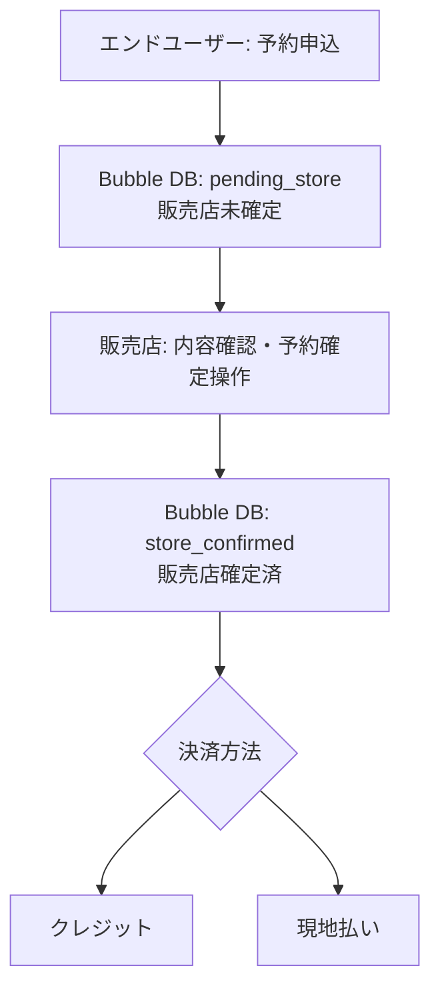

### 3.1 クレジット（To-Be＋Pay.jp）

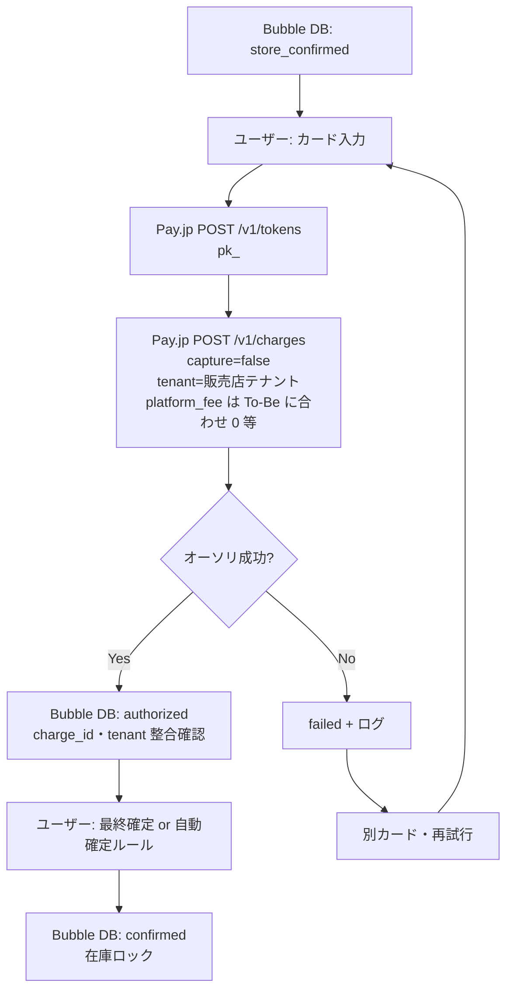

### 3.1.1 クレジット — エラー時フロー図

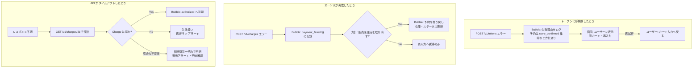

| タイミング | 補足（表との対応） |
|------------|-------------------|
| トークン化失敗 | `store_confirmed` を維持して**決済だけやり直す**か、申込から巻き戻すかはポリシーで固定。 |
| オーソリ失敗 | 販売店確定の取消しは**ビジネスルール**（図の A3）。 |
| タイムアウト | 二重課金防止のため **照会で実体確認**してから DB を進める。 |

### 3.2 現地払い（To-Be）

| 論理名 | Pay.jp | Bubble（主） |
|--------|--------|----------------|
| `pay_at_store` | **API なし**（Charge 未作成） | 予約情報のステータス／現地払いフラグ（§3.0.1） |
| `captured_equivalent` | **API なし** | 精算完了日時・ステータス（**要設計**の date / Option） |

**フィールド例（予約情報）:** ステータス `______option________` を「現地払い・未精算／精算済」等に分ける、または boolean で並記。`charge_id_text` は**空のまま**とし、クレジット経路と判別できるようにする。

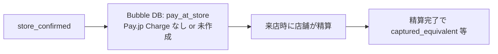

Pay.jp を使わない場合は **`tenant` ミスによる誤入金は発生しない**が、**在庫・ステータス**はクレジットと同じ厳密さで管理する。

---

## 4. キャンセル（To-Be）

### 4.1 まず用語：`store_confirmed` は何か／API を打つか

| 用語（本文中の論理名） | 意味 | Pay.jp API を使うか |
|------------------------|------|---------------------|
| `pending_store` | ユーザーが申込済みだが、**販売店がまだ確定していない**状態（To-Be でこうしたい、という**目標状態のラベル**）。 | **使わない**（Bubble 上の DB 更新のみ）。 |
| `store_confirmed` | 販売店が内容を確認し、**予約を受諾した**状態（同上、論理名）。 | **使わない**。販売店画面の操作 → Bubble ワークフローで **データ型「予約情報」のフィールドを更新**するだけ。 |
| `authorized` / `charge_id` あり | クレジットの**オーソリ済み**で、Pay.jp に **Charge** が存在する。 | キャンセル時に **未キャプチャ／キャプチャ済**に応じて API の要否が変わる（後述）。 |

**要点:** 「販売店確定」「キャンセル方針に従った更新」そのものに **Pay.jp は関与しない**。  
Pay.jp が出てくるのは **すでに `charge_id`（Pay.jp の Charge）が予約に紐づいているとき**だけ。

### 4.2 「方針に従い DB 更新」とは

**＝ Bubble アプリのデータベース（データ型）を、ワークフローまたは API Workflow で更新する**こと。

- 本ドキュメントでは主に **データ型「予約情報」**（エクスポート上の internal 名は `____`）を**キャンセルの主レコード**とみなす。
- 子や関連として **「自転車予約詳細」**（`_______1`）のリスト、**User（店舗）**、必要に応じて **自転車（Bicycle）** や **営業カレンダー** 側の「埋まり」解除も同じワークフロー内で行う想定。

**現行 Bubble のフィールド例（予約情報）— キャンセル時に触り得るもの**

| 表示名（例） | internal フィールド名（参考） | キャンセル時の更新イメージ（To-Be／要設計） |
|--------------|-------------------------------|---------------------------------------------|
| ステータス | `______option________`（Option） | キャンセル済みなど**区分値**へ変更。 |
| charge_id | `charge_id_text` | オーソリ／課金の参照。返金後も**監査用に残すか消すか**は方針で決める。 |
| 返金 charge_id | `__charge_id1_text` 等 | 返金処理と紐づける ID を保存する例（既存フィールド）。 |
| 返金済み | `____1_boolean` | 返金完了フラグ。 |
| 請求済み | `_____boolean` | キャンセルと同時に請求状態をどうするかは業務ルール。 |
| 自転車予約詳細 | `________list_custom________1` | 明細の削除 or ステータス更新、在庫に相当する解放。 |

To-Be で **`store_confirmed` 用の専用フィールド**を新設する場合は、上表の「ステータス」の Option 値を増やすか、`boolean`「販売店確定済み」を足すなど**実装で選択**する。論理名 `store_confirmed` はその**結果として満たすべき状態**を指す。

### 4.3 キャンセル処理の細分化（誰が・何を・API は）

| 順 | 処理 | 実行主体 | Bubble DB（主に触るデータ） | Pay.jp API |
|----|------|----------|-----------------------------|------------|
| 1 | キャンセル権限・期限の判定 | アプリ（条件分岐） | 予約情報（ステータス・日時・店舗） | なし |
| 2 | **方針に従い DB 更新** | ワークフロー | 予約情報の**ステータス**をキャンセル系に変更。**自転車予約詳細**の整理、**在庫／カレンダー相当**の解放（設計したフィールド・関連） | なし |
| 3 | `charge_id_text` が空か確認 | 同上 | 読み取りのみ | — |
| 4a | Charge **なし**（現地払いのみ、未オーソリ等） | 同上 | 2 で完了。追加の外部決済なし | **呼ばない** |
| 4b | Charge **あり・未キャプチャ** | サーバー推奨 | 予約情報を参照して `charge_id` を取得 | **未キャプチャの解放**は Pay.jp 仕様に従う（失効待ち／可能な取消系）。Bubble から API Connector で実行するかは実装次第 |
| 4c | Charge **あり・キャプチャ済** | サーバー推奨 | 同上 | `POST /v1/charges/:id/refund`（全額／一部は方針） |
| 5 | 監査・整合 | Webhook 任意 | 予約情報の返金済みフラグ等を更新 | `charge.refunded` 等で**冪等**更新 |

「在庫解放」は **Bubble 上のどの Thing をどう変えるか**をプロダクトで固定すること（例: 自転車予約詳細を削除、または「キャンセル」ステータスにし、Repeating Group の検索条件から外す／営業カレンダーの枠を空ける等）。

### 4.4 フロー図（§4.1〜4.3 と対応）

販売店確定の**前／後**でキャンセル可否・手数料が変わる想定。図中の `store_confirmed?` は **論理判定**（実装では「ステータスが○○」や「販売店確定フラグ」など）。

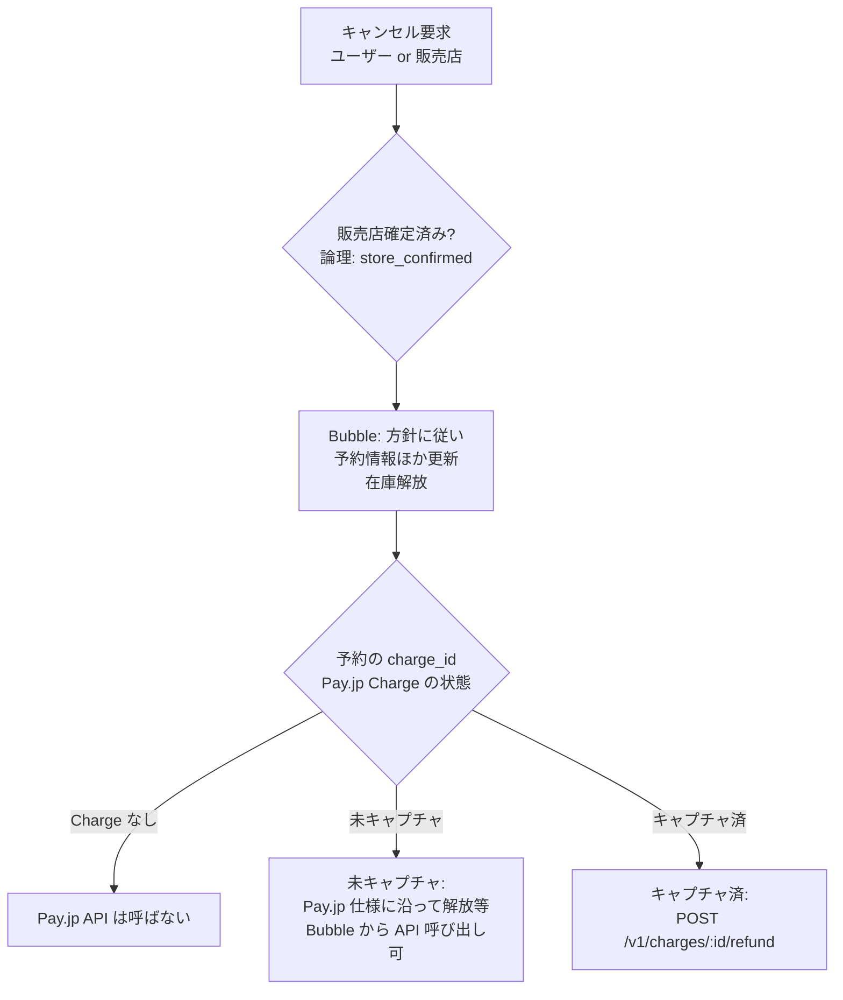

### 4.5 キャンセル — エラー時フロー図（返金 API 失敗など）

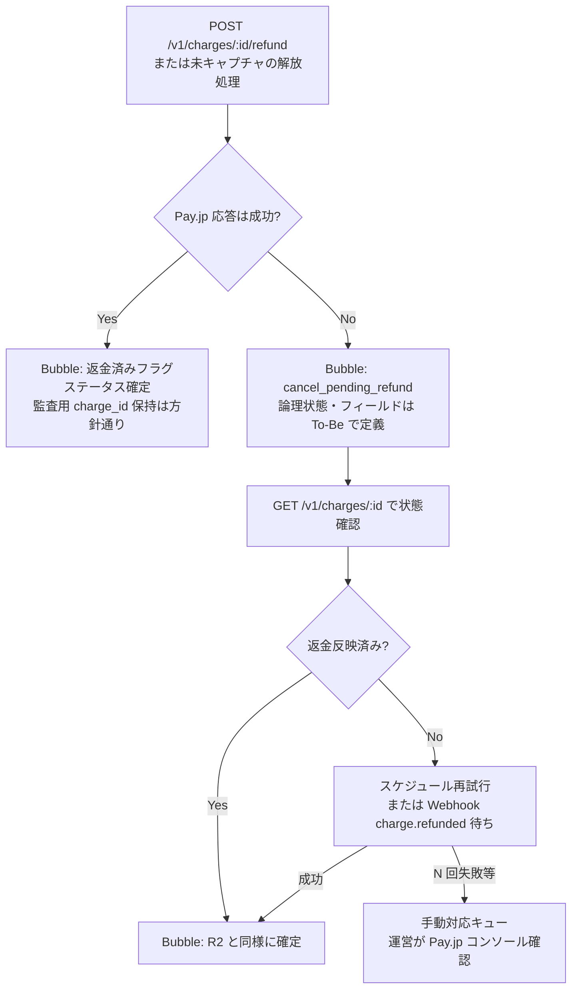

**DB と Pay.jp の順序（方針）**

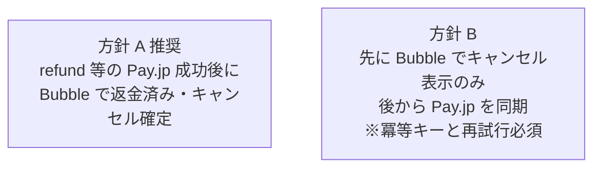

一般的には **方針 A（返金 API 成功 → 返金済みフラグ）** が監査しやすい。方針 B にする場合は **二重返金防止**と**再試行**を必ず組む。

| 状況 | あるべき処理（図との対応） |
|------|---------------------------|
| **返金 API 失敗** | 図: R3→R4→R5…。**cancel_pending_refund** からの脱出は照会・Webhook・手動。 |
| **未キャプチャ解放の API 失敗** | 同様に **pending_release** 的な状態を用意し、照会・期限失効・手動。 |

---

## 5. レンタル当日 — キャプチャ〜貸出（クレジット）

前提は論理状態 **`authorized`**（`charge_id_text` あり・未キャプチャ）。§3・§4 と同じく主レコードは **予約情報**（`____`）。

### 5.0 論理状態と Pay.jp API・Bubble（当日キャプチャ）

| 論理名（本文） | 意味 | Pay.jp API | Bubble（主） |
|----------------|------|------------|--------------|
| `authorized` | オーソリ済み・当日キャプチャ前 | 参照のみ（`charge_id`） | `charge_id_text`、ステータス |
| `captured` | キャプチャ成功・課金確定 | `POST /v1/charges/:id/capture` | ステータス、**キャプチャ日時**（要設計）、§6 と整合 |
| `capture_pending_retry`（例） | キャプチャ API 失敗後、**再試行待ち**（To-Be で Option／フラグ） | 再試行時に同 API | 予約情報に中間状態を残し**二重 capture 防止**（§5 文末） |
| 別カード／店頭フォールバック | オーソリ失効や拒否時の救済 | **新規** `tokens` → `charges`（方針により）または **Charge なし**の店頭精算 | 新 `charge_id` の紐づけ方針・旧 charge の解放／失効は §4・§5.1 と整合 |

**フィールド例（予約情報・当日）**

| 表示名（例） | internal（参考） | キャプチャ時のイメージ |
|--------------|------------------|-------------------------|
| ステータス | `______option________` | `authorized` → `captured` 相当へ |
| charge_id | `charge_id_text` | 原則**同じ ID**で capture（別カード時は**新 charge**と方針固定） |
| 課金・貸出日時 | （要設計 `date`） | 監査・レポート用 |

| 順 | 処理 | Bubble | Pay.jp |
|----|------|--------|--------|
| 1 | 来店・ライド開始操作 | 販売店 UI | — |
| 2 | authorized 確認 | `charge_id_text`・ステータス読取 | — |
| 3 | キャプチャ | 成功時にステータス等を更新 | `POST /v1/charges/:id/capture` |
| 4 | 整合（推奨） | Webhook で冪等確定（§6） | `charge.captured` 受信 |

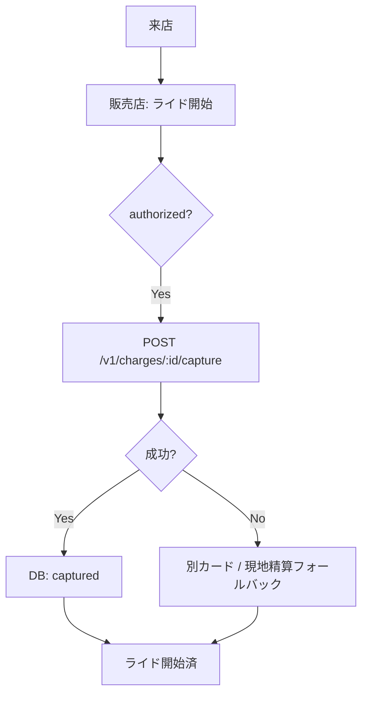

**二重キャプチャ防止:** 予約単位で冪等キー／サーバー側ロック。

### 5.1 キャプチャ — エラー時フロー図

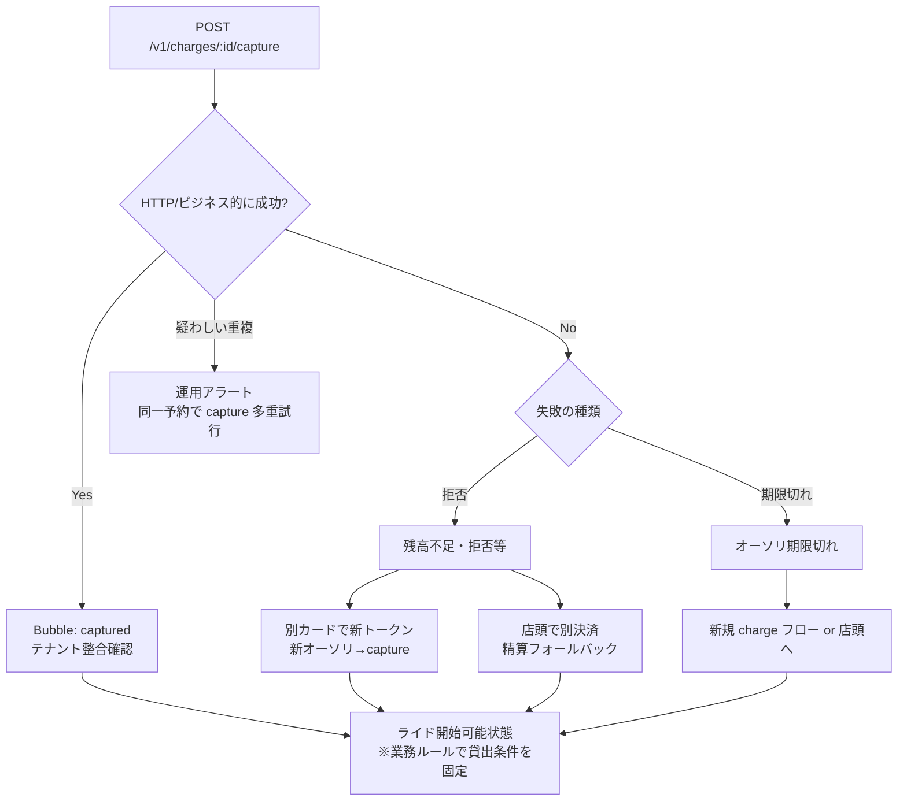

---

## 6. Webhook（To-Be でも必須）

Pay.jp から Bubble への**受信のみ**（Bubble から Pay.jp を**呼ばない**）。エンドポイントは **Backend Workflow API** 等、**署名検証**をサーバー側で行う前提（§6.2）。

### 6.0 イベント種別・Bubble 更新・フィールド例

| event（例） | 論理／目的 | 更新する Bubble（主） | 触り得るフィールド例 |
|-------------|------------|------------------------|----------------------|
| `charge.captured` | 課金確定を**冪等**で反映 | 予約情報（`charge_id_text` で検索） | ステータス `______option________` → `captured` 相当、日時フィールド |
| `charge.refunded` | 返金完了の裏取り | 予約情報 | `____1_boolean`（返金済み）、§4.2 |
| `charge.failed` 等 | 失敗の通知 | 予約情報 | ステータス failed 系、通知用 |
| その他 | 採用する event は実装で固定 | 同上 | **冪等キー**（`charge.id` + `event.id` 等）をログまたは専用 Thing に |

**データ型の例:** 監査用に **Webhook 受信ログ**（専用 Thing）を置き、`charge_id`・`event.type`・生 payload の要約・処理結果を保存する設計も可。

### 6.1 正常系

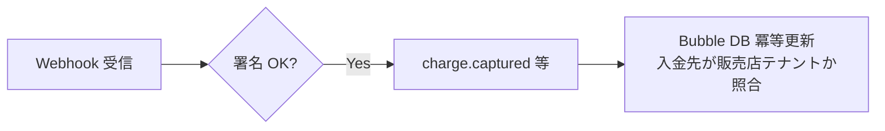

### 6.2 エラー・異常時フロー図

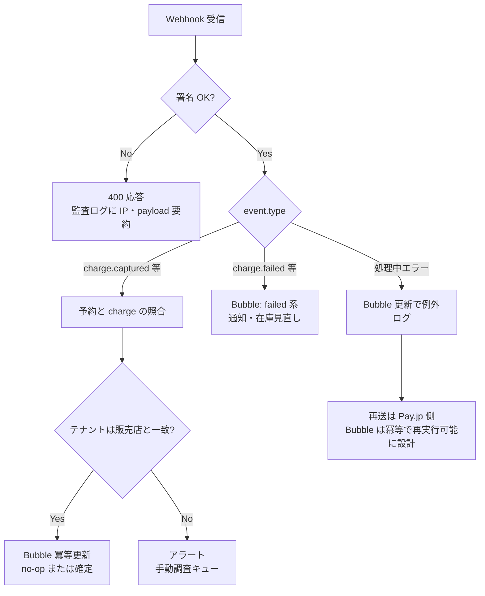

`charge.captured` 受信時、**ダッシュボードの入金先テナント**と予約の販売店が一致するかを運用で確認できるようにする。

---

## 7. 金の流れ（To-Be）— 概念図

予約の**論理状態**と Pay.jp／Bubble の対応は **§3.0**・**§9**（業務フロー）、本節は**誰にいくら入るか**の概念のみ。

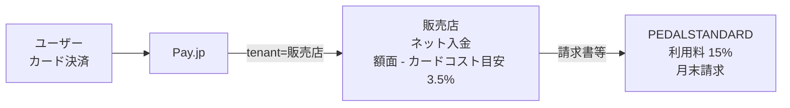

---

## 8. 延長

| 内容 |
|------|
| 実績なし・**機能の生存未確認**。To-Be の決済ルールを載せる前に **E2E 検証**。 |

検証後は **論理状態**（例: 延長中／延長課金済）を **§3.0 と同形式**で追記し、触る **データ型・フィールド例・Pay.jp API** を表に足す。

---

## 9. API と Bubble DB の対応（クイック）

詳細は **§3.0〜3.0.2**（申込〜確定）、**§4**（キャンセル）、**§5.0**（キャプチャ）、**§6.0**（Webhook）を正とする。下表は横断の目次用。

| ステップ | 論理状態（例） | 主データ型 | フィールド例（予約情報） | Pay.jp（例） |
|----------|----------------|------------|--------------------------|--------------|
| 申込 | `pending_store` | 予約情報・明細 | ステータス `______option________` | — |
| 販売店確定 | `store_confirmed` | 予約情報 | 同上 | — |
| カード入力 | `store_confirmed` | （カードは DB に持たない） | — | `POST /v1/tokens` |
| オーソリ | `authorized` | 予約情報 | `charge_id_text`、ステータス | `POST /v1/charges`（`capture=false`、**`tenant`=販売店**） |
| ユーザー最終確定 | `confirmed` | 予約情報・明細 | ステータス、`________list_custom________1` | — |
| 当日確定課金 | `captured` | 予約情報 | ステータス、日時（要設計） | `POST /v1/charges/:id/capture` |
| 現地払い | `pay_at_store` → `captured_equivalent` | 予約情報 | ステータス／フラグ、`charge_id_text` 空 | Charge なし |
| キャンセル | §4.1 参照 | 予約情報・明細 | §4.2 | refund／解放は §4.3 |
| Webhook 整合 | — | 予約情報（＋ログ可） | §6.0 | 受信のみ |

---

## 10. Bubble 修正時の確認チェックリスト

- [ ] Charge 作成時の **`tenant` が「予約の販売店」の Pay.jp テナント ID と一致するか  
- [ ] **`platform_fee` / 料率**が To-Be（15% は**月末請求**）と矛盾していないか  
- [ ] Webhook で受けた `charge` の **テナント／金額**が Bubble の予約と一致するか  
- [ ] 販売店確定前にオーソリだけ走る経路が**残っていないか**（ワークフロー・画面遷移）  
- [ ] 現地払いで Pay.jp が**誤って動いていないか**  
- [ ] 延長の有無とテスト計画  

---

## 11. 関連ドキュメント

- Rincle が**現状**持つ Pay.jp コネクタ一覧（Bubble エクスポート由来）: `docs/bubble-current/payjp-rincle-bubble-usage.md`  
- Pay.jp API 全体像（日本語）: `docs/bubble-current/payjp-api-summary-ja.md`  
- 受領 UI フロー（参考）: `documents/99_ receives/page/flow_credit.html`（別管理リポジトリに置かれている場合あり）  

---

## 12. 決め残し（契約・会計）

- [ ] 15% の課税・端数・計算基準（総額／ネット）  
- [ ] 3.5% と Pay.jp 契約料率の表記揃え  
- [ ] 月末請求の締め日・入金日・未払い時の運用  
