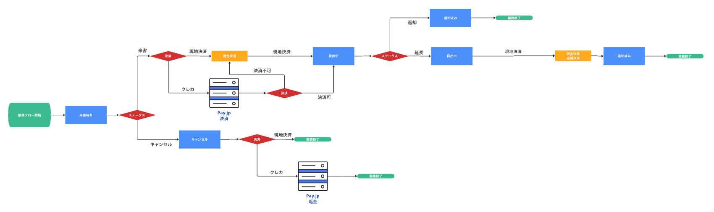
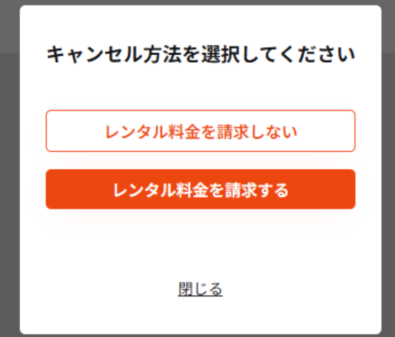

# 改修スコープ

## サマリ

| # | カテゴリ | 概要 | ステータス |
|---|---|---|---|
| 1 | [想定ユースケース①](#1-想定ユースケース) | 検索・予約・受取・返却の基本フロー | 確定 |
| 2 | [想定ユースケース②](#2-想定ユースケース-1) | 延長・料金管理・CSV・メールの管理系フロー | 確定 |
| 3 | [全体設計](#3-全体設計) | 決済フロー全体の状態遷移 | 確定 |
| 4 | [店舗設計](#4-店舗設計) | 店舗カレンダー管理・決済・料金テーブルの仕様 | 確定 |
| 5 | [ユーザー設計](#5-ユーザー設計) | 検索ロジック・カート・キャンセルの仕様 | 確定 |

---

## 1. 想定ユースケース①

ユーザーが自転車を借りてから返すまでのメインフロー。

### リアルタイム在庫検索

ユーザーがエリア・日程・車種で条件を入力し、空き車体を検索する。

| ステップ | 内容 |
|:---:|---|
| ① | 検索条件入力（エリア・貸出／返却日時・車種） |
| ② | 検索ボタンを押す |
| ③ | 空き車体の一覧が店舗ごとに表示される |

### 予約確定

車体を選んでから決済までの流れ。プランと料金は自動計算される。

| ステップ | 内容 |
|:---:|---|
| ① | 車体を選択する |
| ② | 貸出期間からプランと料金が自動計算される |
| ③ | ユーザー情報と支払方法を入力する |
| ④ | 決済Gateway（Pay.jp等）を呼び出す |
| ⑤ | 予約レコードが作成される |
| ⑥ | 確定メールが送信される |
| ⑦ | キャンセル操作も可能（前日23:59:59まで） |

### 受取／返却 & 決済

店舗スタッフが受付・返却の操作を行い、決済を確定する。

| ステップ | 内容 |
|:---:|---|
| ① | 店舗スタッフがライド開始の受付入力をする |
| ② | 本決済が始動する |
| ③ | 返却時もスタッフが同様に入力し、決済を確定する |

---

## 2. 想定ユースケース②

延長・管理系機能のフロー。

### 延長申請 & 自動課金 & 決済

ユーザーがマイページから延長を申請し、追加料金が決済される。

| ステップ | 内容 |
|:---:|---|
| ① | マイページで「延長」を選択し、追加時間を入力する |
| ② | 追加料金が自動計算され、ユーザーが確認・決済する |
| ③ | 予約レコードが延長後の期間に更新される |

### 料金テーブル管理

管理者が料金プランを変更できる。変更は即時反映される。

| ステップ | 内容 |
|:---:|---|
| ① | 管理画面でプランごとの金額を編集する |
| ② | 保存時にキャッシュがクリアされ、以降の予約に新料金が適用される |

> ＊変更前に作成された予約には旧料金テーブルが使われる（既存予約への影響なし）

### CSV出力

店舗の予約一覧を生データとして出力できる。ステータスごとに絞り込めるため、Excelで売上集計が行える状態であればOK。

### メール

| # | 対応内容 |
|---|---|
| 1 | 送信するメールの一覧を作成する |
| 2 | 各メールの文章を作成し、システムに適用する |

---

## 3. 全体設計

### 検証スコープ②：予約確定 & 決済フロー

業務フロー開始から業務終了までの全体的な状態遷移を示す。
来客対応・キャンセル・延長の3つのルートがある。

> 参照元：https://cacoo.com/diagrams/ZYFGgI5U20FRWA7i/AC191

#### フロー概要

**① 来客受付〜貸出**

来客が訪れると決済方法を選択する。クレカはPay.jpを経由し、決済可の場合のみ貸出中に進む。

| ステータス | 分岐 | 次のステップ |
|---|---|---|
| 来客待ち | 来客 | 決済方法の選択へ |
| 来客待ち | キャンセル | キャンセル処理へ |
| 決済（現地） | - | 現地決済 → 貸出中へ |
| 決済（クレカ） | 決済可 | Pay.jp決済 → 貸出中へ |
| 決済（クレカ） | 決済不可 | 再試行（ループ） |

**② 貸出中〜返却**

貸出中は返却か延長のどちらかに進む。延長時は現地決済のみ。

| ステータス | 分岐 | 次のステップ |
|---|---|---|
| 貸出中 | 返却 | 返却済み → 業務終了 |
| 貸出中 | 延長 | 貸出中（継続）→ 現地決済 → 返却済み → 業務終了 |

**③ キャンセル処理**

キャンセル時の返金方法は決済方法によって異なる。

| 決済方法 | 処理 |
|---|---|
| 現地決済 | そのまま業務終了（現金は店舗で対応） |
| クレカ | Pay.jpで返金処理 → 業務終了 |

---

## 4. 店舗設計

---

### 検証スコープ①：リアルタイム在庫検索

> 参照元：https://docs.google.com/spreadsheets/d/1zeVh8UUZHqfJt6No7NAJmEZ3l1a8AWY0wFLw_oCv88s/edit?gid=1863834683#gid=1863834683

#### 概要

店舗の営業日と営業時間を管理する機能。
以下の2つの仕組みで常に365日分のデータが維持される。

- **自動追加**：毎日バッチが動き、1日分ずつデータを追加し続ける
- **店舗設定**：店舗が曜日ごとの営業状態を設定すると、その日以降のデータに反映される

#### カレンダーデータの生成タイミング

| タイミング | 対象データ | 生成される日付範囲 | 実行回数 |
|---|---|---|:---:|
| 本番環境デプロイ時 | デフォルトカレンダー | 〜2026年9月末 | 1回のみ |
| 毎日（バッチ） | デフォルトカレンダー | 1日分を追加 | 毎日1回 |
| 店舗の曜日を初期設定したとき | 店舗カレンダー（空データ） | 作成日から1年間 | 初期設定時1回 |
| 毎日（バッチ） | 店舗ごとのカレンダー | 1日分を追加 | 毎日1回 |
| 店舗が曜日設定を変更したとき | 店舗の曜日カレンダー | 翌日以降を更新 | 変更のたびに実行 |

> ＊曜日を変更したとき、翌日以降に予約が入っている可能性があるが、アラートを表示するのみでデータの変更は行わない

#### カレンダー更新時の自転車ステータス

店舗のカレンダーが更新されると、自転車の「レンタル可・不可」も連動して更新される。

**店舗カレンダー更新時（既存の自転車）**

| 自転車の設定 | 貸出可・不可 | レンタル可・不可 |
|---|:---:|:---:|
| 貸出不可 | 不可 | 不可 |
| 貸出可 | 可 | 不可（※別途レンタル可設定が必要） |

**自転車を新規作成したとき**

| 自転車の設定 | 貸出可・不可 | レンタル可・不可 |
|---|:---:|:---:|
| 貸出不可 | 不可 | 可（初期状態はレンタル可） |

#### 貸出不可の自転車の表示テキスト

貸出不可に設定されている自転車は、ユーザー向けの表示テキストを変更する。
「ユーザー表示」と「ユーザー非表示」の2パターンで表示内容が変わる。

---

### 検証スコープ②：予約確定

#### キャンセル仕様

キャンセルボタンは常に画面上に表示される。
ユーザーと店舗でキャンセルできる条件が異なる。

> 参照元：https://docs.google.com/spreadsheets/d/1zeVh8UUZHqfJt6No7NAJmEZ3l1a8AWY0wFLw_oCv88s/edit?gid=1349156282#gid=1349156282

**キャンセルロジック**

| キャンセルタイミング | ユーザーキャンセル | 店舗キャンセル | 返金有無 |
|---|:---:|:---:|---|
| ライド前日の23:59:59まで | 可 | 可 | 可（＊店舗で選択） |
| ライド当日 | 不可 | 可 | 可（＊店舗で選択） |

---

### 検証スコープ③：受取／返却 & 決済

> 参照元：https://docs.google.com/spreadsheets/d/1zeVh8UUZHqfJt6No7NAJmEZ3l1a8AWY0wFLw_oCv88s/edit?gid=2037064325#gid=2037064325

#### 操作と貸出ステータスの関係

店舗スタッフが操作できるボタン（ライド開始・終了・キャンセル・延長）は、現在の貸出ステータスによって変わる。

凡例：● 押下可　○ 表示活性（押下不可）　- 非表示

| | ① 来客対応 | ② 延長 | ③ 返却 | ④ キャンセル |
|---|:---:|:---:|:---:|:---:|
| **対応している決済方法** | | | | |
| クレカ | ● | ● | ● | ● |
| クレカ失敗（現地） | ● | ● | ● | ● |
| 現地決済 | ● | ● | ● | ● |
| **操作前のステータス** | | | | |
| 来客待ち | ● | | | ● |
| 貸出中 | | ● | ● | |
| 返却済み | | | | ● |
| キャンセル | | | | ● |
| **操作できるボタン** | | | | |
| ライド開始 | ● | - | - | ● |
| ライド終了 | - | ● | ○ | |
| キャンセル | ○ | ● | - | ● |
| 延長 | - | ○ | ● | ● |
| **操作後のステータス** | | | | |
| 貸出中 | ● | | | ● |
| 返却済み | | | ● | |
| キャンセル | | ● | | |

#### 決済ステータスの遷移パターン

各操作（来客対応・キャンセル・返却・延長）での決済ステータスがどう変わるかを示す。

| | ①A | ①B | ②A | ②B | ③A | ③B | ④A | ④B |
|---|:---:|:---:|:---:|:---:|:---:|:---:|:---:|:---:|
| **決済方法** | | | | | | | | |
| クレカ | ● | ● | ● | ● | ● | ● | ● | ● |
| クレカ失敗（現地） | ● | ● | ● | ● | ● | ● | ● | ● |
| 現地決済 | ● | ● | ● | ● | ● | ● | ● | ● |
| **操作前の決済ステータス** | | | | | | | | |
| 未決済 | ● | | ● | | ＊１ | | ● | |
| 決済済み | | ● | | ● | ● | ● | | ● |
| 返金済み | | | | | | | | |
| **操作** | | | | | | | | |
| ライド開始 | ● | ● | | | | | | |
| キャンセル | | | ● | ● | | | | |
| ライド終了 | | | | | ● | ● | | |
| 延長 | | | | | | | ● | ● |
| **操作後の決済ステータス** | | | | | | | | |
| 決済済み | ● | ● | | | ● | ● | | ● |
| 返金済み | | | ● | ● | | | | |
| 未決済 | | | | | | | ● | |

> ＊１：延長料金が発生している場合のみ未決済状態が存在する

#### 在庫への反映ルール

| ケース | 仕様 |
|---|---|
| 期間延長した場合 | 延長分の日程が在庫に反映される |
| 期間を短縮した場合 | 「返却済み」ステータスになった予定のみ、在庫の変更が可能 |

---

### 検証スコープ③：受取／返却 & 決済（計算プラン）

#### 決済期間プラン

レンタルは以下の4つの期間プランで契約できる。
画面上はプラン名を非表示にし、料金のみを表示する。

| プラン | 備考 |
|---|---|
| 1時間 | - |
| 1日 | - |
| 1週間 | - |
| 1か月 | - |

> ＊最大貸出日数は運用でカバーする（システム要件には含まない）

#### 計算プランの自動判定ロジック

返却日時と貸出日時の差分から、以下のプランが自動適用される。
自転車詳細画面の条件Dropdownには営業時間のみ表示される。

| プラン | 料金（税抜） | 適用条件 |
|---|---|---|
| 〜3時間 | ¥880 | 1時間 ≦ 返却日時 - 貸出日時 ＜ 4時間 |
| 4時間以上〜1日 | ¥3,300 | 4時間 ≦ 返却日時 - 貸出日時 ≦ 貸出日の営業終了時間 |
| 1泊（2日間） | ¥13,200 | 返却日の日付 - 貸出日の日付 = 1日 |
| 2泊（3日間） | ¥27,500 | 返却日の日付 - 貸出日の日付 = 2日 |
| 3泊〜6泊（〜7日間） | ¥27,500 | 返却日の日付 - 貸出日の日付 ≧ 3日 |
| 7泊〜13泊（〜14日間） | ¥27,500 | 返却日の日付 - 貸出日の日付 ≧ 7日 |
| 14泊〜29泊（〜30日間） | ¥27,500 | 返却日の日付 - 貸出日の日付 ≧ 14日 |

---

### 検証スコープ③：受取／返却 & 決済（延長ロジック）

延長時の追加料金は、**同日の営業終了時間内かどうか**で計算単位が変わる。
延長料金は返却時に「延長料金」としてまとめて現地決済される。

> ＊期間内に別の予約が入っている場合は、前日までしか延長できない

**延長ロジック表**

| 返却タイミング | 計算単位 |
|---|:---:|
| 返却日が同日かつ営業終了時間前 | 1時間 |
| 返却日が同日かつ営業終了時間以降 | 泊数×日料金 |

---

### 検証スコープ④：料金テーブル管理

料金テーブルを変更しても、**変更前に作成した予約には影響しない**。
変更以降に作成された新規予約にのみ、新しい料金テーブルが適用される。

**変更時の予約にかかわるロジック**

| 料金テーブルの変更 | |
|---|---|
| **変更対象** | **利用する料金テーブル** |
| 変更時点で既存の予約 | 変更前の料金テーブル |
| 変更以降の新規の予約 | 新規料金テーブル |

> ＊貸出中の自転車に延長が発生した場合も、変更前の料金テーブルを使用する

---

## 5. ユーザー設計

---

### 検証スコープ①：リアルタイム在庫検索

#### 検索結果の表示ロジック

貸出日・返却日の指定有無によって、検索結果に表示される自転車が変わる。
「貸出不可」の自転車はどの条件でも常に非表示。

| 貸出日 | 返却日 | 全て空きあり | 指定日空きあり | 空き無し | 貸出不可 |
|:---:|:---:|:---:|:---:|:---:|:---:|
| 指定 | 指定 | ○ | × | × | × |
| 未 | 指定 | ○ | ○ | × | × |
| 指定 | 未 | ○ | ○ | × | × |
| 未 | 未 | ○ | ○ | ○ | × |

> 両日指定：完全に空きがある自転車のみ表示
> 片方のみ指定：指定した日に空きがある自転車も表示
> 両日未定：空きが1日でもあれば表示（非活性状態の自転車も含む）

---

### 検証スコープ②：予約確定（カート機能）

#### カートの有効期限

カートは **作成した当日のみ有効**。
翌日になるか、ログインしていない状態でページを開くと自動的に削除される。

**カート削除トリガー**

| # | 削除される条件 | 動作 |
|---|---|---|
| 1 | カート作成日の翌日にページをロードしたとき（例：1/1作成 → 1/2アクセス） | カートを削除する |
| 2 | ログインしていないユーザーがページをロードしたとき | アラートを表示してカートを削除する |

**対象画面**：自転車詳細画面・カート画面（カートに1台以上の自転車がある場合のみアラートを表示）

**削除後の遷移先**

空車検索画面へ遷移し、以下の状態で表示する。

| 項目 | 値 | 備考 |
|---|---|---|
| 都道府県 | カート作成時の値 | 引き継ぐ |
| カテゴリ | 全て | リセット |
| 貸出日 | 未定 | リセット |
| 返却日 | 未定 | リセット |

---

### 検証スコープ②：予約確定（キャンセル）

ユーザーはライド前日の23:59:59までキャンセルができる。
期限を過ぎるとキャンセルボタンは表示されたまま非活性になる（押せない状態）。

| # | 仕様 |
|---|---|
| 1 | ライド前日の23:59:59まではキャンセルボタンが押せること |
| 2 | ライド当日（0:00以降）はキャンセルボタンが表示されるが押せない状態になること |
