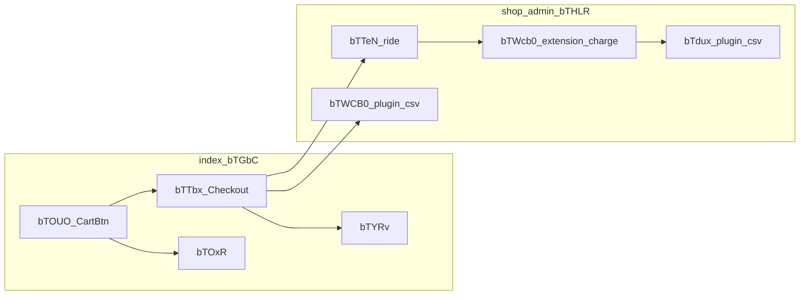

# 予約関連ワークフロー（Bubble エクスポート JSON 根拠）

Bubble Editor からエクスポートした [`documents/2_requirements/99_app_json/rincle.bubble`](../../99_app_json/rincle.bubble) を一次情報として、**予約まわりで Thing の作成・更新や決済 API 呼び出しが走るワークフロー**を整理したものです。

**注意**

- エクスポート JSON では、一部のラベル・アクション名・フィールド識別子が **伏字（`______`）** でマスクされていることがあります。詳細は **Bubble Editor 上の同一ワークフロー**と突合してください。
- `rincle.bubble` に API キー相当が含まれる場合は**リポジトリに置かない／マスクする**運用を推奨します（ユーザー側でキー差し替え予定の旨あり）。
- **データモデル上のレコード遷移**は別稿 [reservation_search_to_extension_payment.md](reservation_search_to_extension_payment.md) と併読してください。本稿は **ワークフロー ID と主アクション列** が主眼です。

---

## 1. ページ ID と画面名（早見）

| page_id | 名前 |
|---------|------|
| `bTGbC` | index（利用者トップ／予約・決済 UI） |
| `bTHLR` | shop_admin（店舗管理） |
| `bTHEd` | admin（本部管理） |
| `bTRDR0` | user_reservation_list（利用者の予約一覧） |

---

## 2. ストーリー別フロー（推奨読み順）

### 2.1 予約〜レンタル実行（ライド）〜返却〜支払い（概要）

| 段階 | ページ | workflow_id | トリガー element_id | ざっくり内容（JSON から読み取れる範囲） |
|------|--------|-------------|---------------------|----------------------------------------|
| カート（仮予約の種まき） | index | `bTOUO` | `bTOTw` | `NewThing`（乗車人・明細・予約情報作成）、複数 `ChangeThing` / `ChangeListOfThings`、`MakeChangeCurrentUser`（カート紐付け）、`ChangePage` |
| 予約確定・決済（カード） | index | `bTTbx` | `bTOBX` | 条件分岐・`apiconnector2-bTHZi`（`bTVNI`, `bTVHy`）→ `MakeChangeCurrentUser` → `ChangeThing`（`Make changes to 予約情報...`）→ 複数 `SendEmail` |
| カード登録（別導線） | index | `bTYRv` | `bTYRX` | `MakeChangeCurrentUser`、`apiconnector2-bTHZi.bTVGG`、`NewThing`（予約情報）、`ChangeListOfThings`、`ChangeThing` など |
| ログイン導線＋予約 | index | `bTOxR` | `bTOwW` | `LogIn` / `LogOut`、`NewThing`（予約情報）、`ChangeListOfThings` など |
| ライド（実行） | shop_admin | `bTTeN` | `bTcuo` | `SetCustomState`、`ChangeThing`、`HideElement`（条件に **「店頭決済」** テキスト照合を含む） |
| 延長などの課金 | shop_admin | `bTWcb0` | `bTcwH` | `SetCustomState` → `apiconnector2-bTHZi.bTVIE` → `ChangeThing` ×2（成否で分岐）→ UI 表示切替 |
| 返却・帳票系（CSV） | shop_admin | `bTdux`, `bTWCB0` | `bTdqL`, `bTSPX1` | 単一アクション型 `1649895805314x598569727070568400-AAQ`（Editor 上のプラグイン名は「csv download」系）。CSV テンプレに **予約番号・貸出/返却日時・合計金額** などが含まれる |

---

### 2.2 予約のキャンセル（料金が発生しない想定）／（発生する想定）

JSON 上、**利用者によるキャンセルで `予約情報` を更新するワークフローは 1 本**に見えます。

| ページ | workflow_id | element_id | 主なアクション |
|--------|-------------|-------------|----------------|
| user_reservation_list | `bTSmh` | `bTSkM` | `ChangeThing`（`Make changes to 予約情報...`）→ `ChangeListOfThings` → 複数 `SendEmail` → `HideElement` / `ShowElement` → `ChangePage` |

**店舗**が予約をキャンセル等するワークフロー（`bTVKs` / `bTVLV`）は **§3.2** を参照。

- **ワークフロー名・ステップ名だけ**では「料金あり」「返金なし」などのラベルは出てこない場合があります。
- 実務上は **(1) 別ボタン＝別ワークフロー**、**(2) 同一 WF 内の条件分岐で `予約ステータス` オプションを「キャンセル／キャンセル（返金なし）」等に設定**、**(3) 後段の課金 WF** のいずれかの可能性があります。**Editor で `bTSkM` クリック時の条件・変更フィールド**を確認するのが確実です。
- 確定メール文面に **「当日のキャンセル…キャンセル料」** の文言が含まれるのは index の `bTTbx` 内 `SendEmail` 系（予約完了メール側）で確認できます（利用規約的テキスト）。

---

### 2.3 その他（予約・延長・返金まわりで JSON に現れるもの）

- **本部 admin `bTgSj`（element `bTgRB`）**、**店舗 `bTgPV0`（element `bTgPK0`）**  
  - JSON 文字列に **「返金」** を含む。アクションはプラグイン `1649895805314x598569727070568400-AAQ`（CSV 出力テンプレに延長・返金系の列が含まれる構成）。**実データ更新はプラグイン仕様に依存**。
- **延長終了・店頭決済文面**  
  - shop `bTWcb0` の `ChangeThing` で **「店頭決済」** テキストや、オプション・金額・`charge_id` 連携が設定されている（API 成否で別ブランチ）。

---

## 3. 予約情報（datatype）の作成・更新が走る箇所（全一覧）

**根拠**: [`rincle.bubble`](../../99_app_json/rincle.bubble) のワークフロー走査、[payjp-dev-reference.md](../../04_integration/pay.jp/payjp-dev-reference.md) の「make change 予約」記述、および **§2.2・§2.3** の記述。

**スクリーンショット（モジュール設計）**  
ローカル作業用フォルダ `Desktop/rincle モジュール設計/` にある PNG（リポジトリ未同梱）と、おおむね次の対応が取れる。**ファイル名は実フォルダのキャプチャ名に合わせています。**

| スクリーンショット例（ファイル名） | おおよその画面 |
|----------------------------------|----------------|
| `カート.png` / `カート・お客様情報の編集.png` | index・カート |
| `支払方法選択.png` / `reservation・予約確認.png` | 決済・予約確認 |
| `マイページ.png` | マイページ上位（予約一覧への入口） |
| `予約詳細.png` | 予約詳細（ユーザー／店舗のいずれかの詳細 UI） |
| `店舗・予約一覧.png` / `店舗・過去の予約.png` | shop_admin・予約一覧／過去 |
| `管理・予約一覧.png` | admin・予約一覧（加盟店と共通リユーザブル） |

---

### 3.1 アクション名に「予約情報」が明示的に出るワークフロー（作成＋更新）

エクスポート JSON で **日本語名が残っている**もの。`ChangeThing` の対象はいずれも **予約情報** Thing とみなせる。

| ページ | `workflow_id` | `element_id` | 作成/更新 | 主アクション（要約） | スクリーンショット対応（目安） |
|--------|---------------|--------------|-----------|----------------------|-------------------------------|
| index | `bTOUO` | `bTOTw` | **作成** | `NewThing`「予約情報作成：カート無し」 | `カート.png` 等 |
| index | `bTOUO` | `bTOTw` | **更新** | `ChangeThing`「カートに予約情報紐づけ」「予約情詳細に予約情報を紐づけ」 | 同上 |
| index | `bTTbx` | `bTOBX` | **更新** | `ChangeThing`「Make changes to 予約情報...」（確定・token 等） | `reservation・予約確認.png` / `支払方法選択.png` |
| index | `bTOxR` | `bTOwW` | **作成** | `NewThing`「Create a new 予約情報...」（ログイン導線） | （カート〜確定の別導線） |
| index | `bTYRv` | `bTYRX` | **作成** | `NewThing`「Create a new 予約情報...」（カード登録中心導線） | `支払方法選択.png` 近辺 |
| user_reservation_list | `bTSmh` | `bTSkM` | **更新** | `ChangeThing`「Make changes to 予約情報...」（利用者キャンセル等） | `マイページ.png` 起点の予約一覧／キャンセル UI |

---

### 3.2 アクション名が伏字でも「予約情報」行を更新する実装（店舗・管理者）

`ChangeThing` の **オブジェクト名が JSON に出ない**ことがあります。以下は **同一ページ上の予約 UI**、[`payjp-dev-reference.md`](../../04_integration/pay.jp/payjp-dev-reference.md) の記述、または **API（`bTVIE`／`bTVFu`）＋ `ChangeThing` の並び**から、**予約情報レコードの更新**に当たると判断したもの。**最終確認は Bubble Editor**（当該アクションの「Change …」対象 Thing）で行ってください。

#### 加盟店（`shop_admin` / page `bTHLR`）

| スクリーンショット例 | `workflow_id` | `element_id` | 概要（`rincle.bubble`） |
|----------------------|---------------|--------------|-------------------------|
| `店舗・予約一覧.png` / `予約詳細.png` | `bTTeN` | `bTcuo` | ライド開始: `SetCustomState` → `ChangeThing` → `HideElement`（`payjp-dev-reference` のライド開始・請求反映） |
| `予約詳細.png`（延長 UI） | `bTWcb0` | `bTcwH` | 延長の決済: `bTVIE`（`Charge_by_car_id`）→ `ChangeThing` ×2（成否分岐） |
| `店舗・予約一覧.png` | `bTVKs` | `bTVKV` | `ChangeThing` → `ChangeListOfThings` ×2 → メッセージ（**店舗側キャンセル等**。利用者 `bTSmh` と同型） |
| 同上 | `bTVLV` | `bTVLK` | 上記と同構造（別ボタン／条件想定） |
| `予約詳細.png` / 延長 | `bTUAL` | `bTTjH` | `ChangeThing` 複数 + `ChangeListOfThings`（営業カレンダー明示アクションあり。延長に伴う **予約＋カレンダー** は `payjp-dev-reference` と整合） |
| `予約詳細.png`（ライド終了） | `bTdud` | `bTdpn` | `bTVIE` + `ChangeThing` 複数（延長清算・返却系の別導線） |

#### 管理者（`admin` / page `bTHEd`）

| スクリーンショット例 | `workflow_id` | `element_id` | 概要（`rincle.bubble`） |
|----------------------|---------------|--------------|-------------------------|
| `管理・予約一覧.png` | `bTXOb0` | `bTXNN0` | 返金: `ChangeThing` → `bTVFu` ×2（`Charge_refund`）→ `ChangeThing` → `ChangeListOfThings` ×2（[`payjp-flow-asis.md`](../../04_integration/pay.jp/payjp-flow-asis.md) の返金フロー） |
| `管理・予約一覧.png` | `bTXOH0` | `bTXNM0` | `ChangeThing` → `ChangeListOfThings` ×2（ステータス変更・カレンダー更新。**返金 API なし**の分支想定） |
| `管理・予約一覧.png` | `bTXdC0` | `bTRCr` | `InputChanged`: `bTVIE` + `ChangeThing` ×2（ドロップダウンで **来客待ち・未請求** 等への課金——`payjp-dev-reference`「課金」行） |

**プラグイン CSV のみ**で、本体 WF に `ChangeThing` が無いもの（**予約行の更新はワークフロー内ではなくエクスポート用途**）: admin `bTWBd0`（`bTQVt`）、延長・返金 **語**を含む `bTgSj`（CSV テンプレのみ JSON 上「予約」文字あり）。**DB 更新の有無はプラグイン仕様次第**。

---

### 3.3 補足（検索の落ちどころ）

- **index `bTUlY`** — `bTOUO` と同じ `element_id` 系の別 WF。JSON 全体に **「予約情報」文字列は出現しない**ため、本一覧の **3.1 には入れていない**（明細・カレンダー側の可能性。要 Editor）。
- **shop の `ChangeThing` のみ多数**（自転車・オプション編集等）— **対象 Thing が予約情報でない**場合がある。`payjp-dev-reference` に「make change 予約」とある画面操作のみ、3.2 に限定して記載した。

---

## 4. 関連ドキュメント

- レコード観点の整理: [reservation_search_to_extension_payment.md](reservation_search_to_extension_payment.md)
- Pay.JP 連携の文言・行為順: [payjp-flow-asis.md](../../04_integration/pay.jp/payjp-flow-asis.md)

---

## 5. 再抽出（任意）

同ディレクトリの [`parse_bubble_workflow_json.py`](parse_bubble_workflow_json.py) で単体 WF の文字列スキャンが可能です。全ページ横断の一覧は、本稿作成時に Python で `pages[*].workflows` を走査して得ています。
