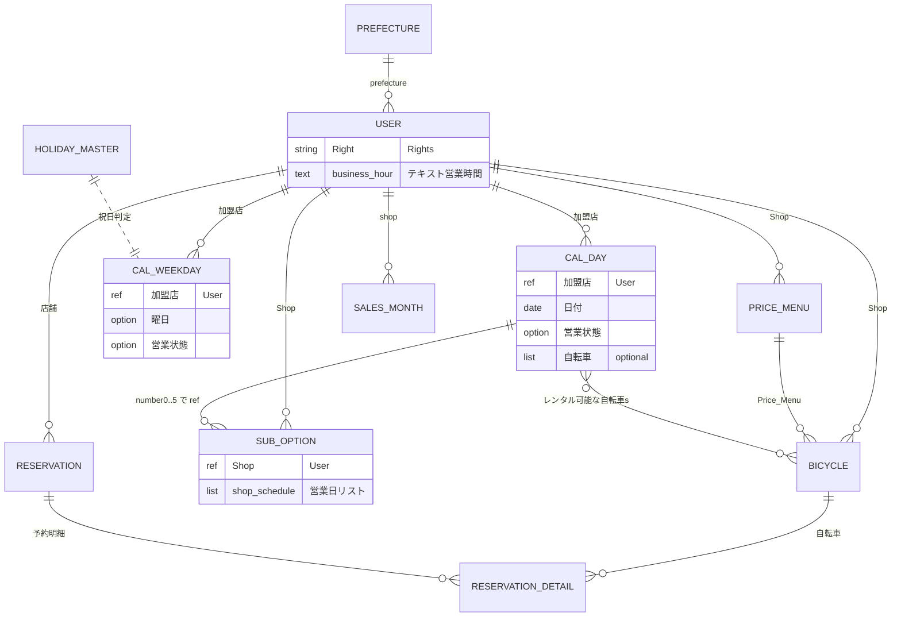

# RINCLE（Bubble）DB 現状分析と変更案（ドラフト）

本書は、リポジトリ内の DB 定義 CSV（[`_index.csv`](./_index.csv) および `datatype/`）および Desktop のモジュール設計スクショ（`/Users/yanokarin/Desktop/rincle モジュール設計`）を根拠に、現状の論点を整理し、**移行・再設計時の「案」** をまとめたものです。テーブル（Bubble の Thing）ごとにフィールド表を付け、現状と変更案それぞれに ER 図を載せています。

---

## 1. 目的とスコープ

- **目的**: 運営（管理者）・加盟店（店舗）・一般ユーザーによる自転車貸出の現行データモデルを可視化し、冗長や分離しづらい部分を洗い出す。
- **スコープ**: datatype / optionset の CSV に現れるものが中心。Bubble 上の実データ件数やワークフロー細部は CSV と矛盾しない範囲。

---

## 2. 営業カレンダー：現状と目指す実装方針

| 区分 | 方式 | 内容 |
|------|------|------|
| **現状（Bubble）** | **(B)** | 店舗×**日付**のレコードを大量に保持する実装になっている（`営業カレンダー（日付）` の行が、対象期間の日数に応じて増える）。本書の**現状分析**はこの前提で記述する。 |
| **目指す姿（本ドキュメントの変更案）** | **(A)** | 曜日テンプレ（＋祝日マスタ）を正本とし、**日付は臨時休業・時間変更など「例外のみ」** を保持。カレンダー画面への「全日の表示」は、ルールの**マージ結果として合成**（必要ならキャッシュテーブルは任意）。**再設計では (A) に寄せる**。 |

営業カレンダー画面の文言は「曜日の標準と異なる日」の編集にも見えるが、データ層は上表のとおり **現状は (B)**。そのため「店舗数 × 日数」にレコードが比例しやすいことが課題であり、変更案セクションで **(A) への移行**（例外テーブル化・オプション在庫の `shop_schedule` 依存の解消など）を述べる。

| 方式 | データの持ち方 | 現状 | 変更案での位置づけ |
|------|----------------|------|---------------------|
| (A) | テンプレ＋祝日＋**例外のみ**／表示は合成 | 未実装（目標） | **採用したい方針** |
| (B) | **全日・全店舗で日別行** | **いまそうなっている** | 縮減・廃止の対象 |

---

## 3. 現状モデル概要（ロールと中心テーブル）

- **利用者タイプ**: `User` のオプション `Right`（`Rights`）で管理者・加盟店・一般ユーザー等を兼用表現。
- **ビジネス中心**: `User`（店舗）→ `Bicycle` / `Price_Menu` / `Sub_Option`。予約は `予約情報` → `自転車予約詳細`／`オプション予約詳細`。
- **営業**: `営業カレンダー（曜日）` が週次テンプレ、`営業カレンダー（日付）` が日次。後者は **(B)** によりレコード膨張しやすい。
- **オプション在庫**: `Sub_Option` が **`shop_schedule`（日別カレンダー行）を複数参照**しており、在庫 UI の「日ごとの数値」と **日別レコード大量前提の設計が結合**している（後述 [`Sub_Option`](#sub_option-サブオプション)）。

---

## 4. 画面とデータの対応（参考）

| 画面（スクショファイル名） | 想定される主な datatype / 備考 |
|----------------------------|----------------------------------|
| 店舗・営業時間設定 | `営業カレンダー（曜日）`＋`Time`／`営業状態op` |
| 店舗・営業カレンダー／編集 | `営業カレンダー（日付）`。編集モーダルの予約影響警告は `予約情報` との突合せが必要 |
| 店舗・在庫設定（自転車） | `Bicycle`＋`営業カレンダー（日付）.レンタル可能な自転車s` 等の関連 |
| 店舗・オプション・在庫設定 | `Sub_Option` と **`shop_schedule`（日付カレンダー）** のリレーションが強い |

---

## 5. 現状 datatype 一覧（サマリ）

`_index.csv` の datatype を用途別に分類した一覧です。

| 区分 | name（CSV） | 説明（index より） |
|------|-------------|---------------------|
| ログ | Access_log | 訪問日時・IP |
| CMS | Banner, FV, News | トップ・お知らせ等 |
| マスタ | Prefecture, Holidays, 日付データ系 | 都道府県・祝日関連 |
| FAQ | Q&A, Q&A Category | |
| ユーザー | User | 店舗・決済・プロフィールの中心 |
| 商品 | Bicycle, Price_Menu, Sub_Option | 自転車・料金・オプション |
| 営業 | 営業カレンダー（曜日）, 営業カレンダー（日付） | |
| 予約 | 予約情報, 自転車予約詳細, オプション予約詳細, 乗車人情報 | |
| 決済・売上 | Webhook_Event, 手数料月ごと, 管理者手数料 | |
| 通知・問合せ | お問い合わせ履歴, お問い合わせ種別, 管理者/運営_news | |
| その他 | 工事中, 銀行口座 | 後者は index 上フィールドなし |

---

## 6. 現状：テーブル（Thing）ごとのフィールド定義

**全フィールドの完全な一覧**は **[付録 A](#付録-a-現状-datatype-全フィールド一覧csv-準拠)** に `datatype/*.csv` からそのまま転記した（各フィールド1行）。

- **セクション 15**に、旧ドラフトで用いた「複数 field_name をカンマで束ねる」表記と CSV の関係を記載。
- **セクション 16–17**に、テーブル単位・主要カラム単位の As-Is / To-Be を記載。

以下は **読み取りのための補足のみ**。

- **`Sub_Option`.`number0` 等**: `ref_target` は `shop_schedule`（ datatype **`営業カレンダー（日付）`** の行と推定）。日別在庫と結合。
- **`お問い合わせ履歴`**: `メールアドレス` / `内容` の display_name が本文と逆の可能性 — 付録 A の `display_name` 列を参照。
- **`銀行口座`**: CSV にデータ行なし（フィールド未定義）。


## 7. 現状の論点（要約）

| # | 論点 | 内容 |
|---|------|------|
| 1 | **日別カレンダー (B)** | `営業カレンダー（日付）` が店舗×日で増加。検索・バックフィル・ストレージ負荷が大きくなりやすい。 |
| 2 | **オプション在庫と日別行** | `Sub_Option` が `shop_schedule` を複数参照。**カレンダー行を「曜日＋例外のみ」に変更する場合、オプション在庫の所在を別設計へ移す必要**がある。 |
| 3 | 祝日・日付マスタ | `Holidays` / `日付データ Defaults` / `日付データ 追加用` の役割重複の可能性。 |
| 4 | 料金の二重保持 | `Bicycle` と `Price_Menu` に類似の金額列。税込／税抜の重複。 |
| 5 | User.business_hour | テキストの営業表記と、構造化された営業テーブルの二重管理リスク。 |
| 6 | 命名 | `お問い合わせ種別` と実フィールド（IP/Rights）の整合要確認。 |

---

## 8. datatype を optionset に寄せる検討候補

Bubble ではざっくり、**optionset** は「列挙値がほぼ固定で、レコードとして検索・大量作成しないもの」、**datatype** は「行が増えるトランザクション・可変マスタ・CMS」向き。次の datatype は **optionset（または既存のグローバル optionset）へ寄せた方がよいかもしれない**候補として整理した。**不向き**なものも区別する。

### 候補一覧

| datatype（`_index`） | optionset 化の妥当性 | コメント |
|----------------------|----------------------|----------|
| **Prefecture** | 高い | 都道府県は **47 固定**であることが多い。`User.prefecture` を **ref → option（都道府県 optionset）** にすると、都道府県 Thing への検索・結合が減る。一方、現状の `Prefecture.Shoplist` のような **「都道府県別の店舗集約」** は、Users を `prefecture` でフィルタするクエリに置き換える必要あり。 |
| **Q&A Category** | 中 | カテゴリ数が少なく、**運営が画面上で自由に増やさない**（デプロイや optionset 編集で足りる）なら optionset で十分。FAQ カテゴリを**よく追加・改名する**なら datatype のままの方が運用しやすい。 |
| **工事中** | 中〜高 | フィールドが実質 **boolean 1 個**で、**サイト全体のメンテ表示**用なら、単独 datatype より **`Admin_info` 等の既存グローバル optionset に統合**する方が軽い。 |
| **お問い合わせ種別** | 要設計 | CSV 上は IP・`Rights` 系で「問い合わせ種別」と名が一致しない。**単純な optionset 化より先に、1 行の意味（ACL ルール？）を整理**。可能なら **既存 `Rights` optionset** やテキストフィールドへの寄せを検討。 |
| **Holidays** | **不向き** | **西暦ごとに日付が増える行データ**。optionset は **任意日付のマスタ**として向かない。日付行は **Thing（ datatype ）**で持つ。 |
| **日付データ Defaults / 日付データ 追加用** | **不向き** | 同上。**日付＋フラグ**は `Holidays` 等の **Thing** で保持。 |
| **管理者手数料** | **不向き** | 数値カウント用と推測され、列挙ではない。 |
| **銀行口座** | （未定義） | フィールドなしなら optionset 以前の整理。 |
| **Access_log / Webhook_Event / 乗車人情報 / 予約系 / 手数料月ごと 等** | **不向き** | ログ・予約・決済は **行が増える**。 |
| **Banner / FV / News** | **不向き** | コンテンツ CMS。 |
| **Bicycle / Price_Menu / Sub_Option** | **不向き** | マスタだが **可変・件数多**。自転車カテゴリは既に optionset **Bicycle Category**。 |

### 既存 optionset との重複に注意

[`_index.csv`](./_index.csv) には既に **Bicycle Category**、**曜日**、**Time**、**Rights** などがある。**datatype の「マスタ」が、実は optionset で足りる重複**になっていないか（Prefecture など）は移行時に洗うとよい。

---

## 9. 現状 ER 図（概念・主要リレーション）



※ `HOLIDAY_MASTER` は `Holidays` / 日付データ系を概念的にまとめたラベル。`USER` は datatype `User` を表す。

---

## 10. 変更案の方針（原則）

1. **正本の分離**: 曜日テンプレ・祝日・**日付は例外のみ**を正本とし、画面用の「全日埋め」は **ビューまたはバッチで生成**（永続化するならキャッシュテーブルで明示的に）。
2. **オプション在庫**: `shop_schedule` への複数 ref に依存せず、**オプションのデフォルト在庫＋日別上書き**（または在庫変動イベント）へ移行する。
3. **料金**: `Price_Menu` を一次情報とし、`Bicycle` は参照＋必要最小限の例外列に圧縮。
4. **予約・決済**: 既存のヘッダ・明細・金額は **監査のためスナップショット維持**を推奨。
5. **祝日**: 法定祝日マスタを単一化し、「アプリ固有の貸出不可日」は別フラグまたは別テーブルで表現。

### 10.1 別案：「貸出可能なモノ」を 1 Thing（Product）にまとめる

**案**: 現状の `Bicycle` と `Sub_Option` を分けず、**レンタル対象はすべて同一 Thing**（例：**`Product`** または **`レンタル品`**）にし、**`種別`**（option / optionset）で **自転車 / ヘルメット / その他オプション…** と区別する。

| 観点 | 内容 |
|------|------|
| メリット | 在庫・予約明細の考え方が一本化しやすい（「何かを日別に何個貸すか」）。UI・検索も「商品一覧」で回しやすい。 |
| 留意点 | 自転車だけ「サイズ・シリアル・カテゴリ」、オプションだけ「親オプション」など **属性の差**が大きい。Bubble では **① 種別ごとに使わないフィールドを空にする**、**② `Product` を親にして `Product_自転車詳細` のような子 Thing を作る（論理上は分離）**、のどちらかが現実的。完全 1 テーブルにすると、**オプション列が多く null になる**（非正規化の一種）。 |
| 既存データ | `Bicycle` / `Sub_Option` をマージするマイグレーションが必要。予約明細は `Product` への参照に寄せる。 |

**判断**: 店舗あたり SKU 数が限られ、**差分属性が許容できるなら**本案はシンプル。自転車と消耗品オプションで **フォーム・ワークフローが完全に別**なら、Thing を分けた現状維持も合理的。

### 10.2 別案：`Shop` Thing を新設し、店舗プロフィールを `User` から切り出す

**案**: **`User` はログイン・権限（`Right`）・Pay.JP・会員属性**に寄せ、**店名・住所・アクセス・店舗コメント・デフォルトの曜日別営業時間**は **`Shop`** に持たせる。`User` は `Shop` を参照（加盟店アカウントは `Shop` に紐づく）。

| フィールドの置き場（概念） | 例（Bubble） |
|------------------------------|--------------|
| 店舗の基本情報 | `Shop`：`shop_name`, `shop_address`, `shop_comment`, `shop_access` 等（現 `User` の `shop_*` から移動） |
| デフォルトの曜日ごと営業 | **`Shop` 上のリスト**で `営業カレンダー（曜日）` を子として持つ、または **`Shop` に曜日×7のフィールド**（要検討。**件数固定なら非正規化で十分**なことも多い） |
| 認証・決済 | `User` に残す |

| 観点 | 内容 |
|------|------|
| メリット | 「店舗」と「ログイン用ユーザー」の責務が分離し、**同一店舗に複数スタッフ**を付けやすい。 |
| 留意点 | 既存ワークフローは **`User` = 店舗** 前提が強いので、参照の付け替え（`Bicycle.Shop` を `User` → `Shop`）が必要。 |
| 営業時間 | 曜日7行は **`店舗あと最大7件`** 程度。**無理に別 Thing に切らず**、`Shop` に埋め込む（リスト型の子オブジェクト）も選択肢（後述）。 |

### 10.3 正規化の度合い（「データが増える」とのトレードオフ）

- **何でも正規化すると**、中間テーブル・参照のたぐいが増え、**レコード件数・検索要件が増える**（ご指摘どおり）。
- **件数が少ない・変化が少ない**領域では、**1 Thing に寄せる・JSON 相当の text で持つ・曜日別をフラットに7列**など、**非正規化でよい**ケースがある。
- **例**: デフォルト営業時間は **店舗ごとに常時7行程度**なら、`Shop` 組み込みまたは `営業カレンダー（曜日）` を `Shop` にぶら下げるだけで足りることが多い。一方、**全日・全店の日別行 (B)** のように **件数が爆発する**箇所だけ、**(A) 例外のみ**など正規化／圧縮を優先する、という**差し引き**が可能。

---

## 11. 変更案：Bubble Thing／フィールド（案）

以降の **Thing 名・フィールド名は Bubble 上の名称案**（既存datatypeは `_index` / 付録 A と同一表記、新規は本アプリの「英日混在・カッコ付き」に合わせた）。

### `User`（既存。店舗／会員の分離は任意）

| フィールド名（案） | Bubble 上の型 | 説明 |
|--------------------|----------------|------|
| （既存 `User` 全フィールド） | 付録 A 準拠 | 現状どおり運用する場合はそのまま。将来、`Right` ごとに別 Thing へ分割する場合のみ設計 |

### `営業カレンダー（曜日）`（既存 Thing）

| フィールド名（既存 CSV） | 型 | To-Be でのメモ |
|--------------------------|-----|----------------|
| `加盟店` | `User` を参照 | 維持 |
| `曜日` | option（`曜日`） | 維持 |
| `営業状態` | option（`営業状態op`） | 維持 |
| `startTime` / `endTime` | option（`Time`） | 維持 |
| `適用開始日` / `適用終了日` | date | **追加案**（季節営業用。未実装なら任意） |

### `営業カレンダー（例外）`（**新規 Thing 案** — (A) で「日付の例外」のみを保持）

現 `営業カレンダー（日付）` のうち、**曜日テンプレ＋祝日と異なる日**だけを格納する用途に名前を切り出す想定（実装では既存 Thing の整理／新 Thing 作成のどちらでも可）。

| フィールド名（案） | 型 | 説明 |
|--------------------|-----|------|
| `加盟店` | `User` を参照 | 必須 |
| `日付` | date | 対象日 |
| `営業状態` | option（`営業状態op`） | 臨時営業・臨時休業等 |
| `startTime` / `endTime` | option（`Time`） | 上書き時間 |
| `メモ` | text | 臨時理由（任意） |

### `自転車貸出不可日`（**新規 Thing 案** — 店全体ではなく特定自転車のみ止める日）

| フィールド名（案） | 型 | 説明 |
|--------------------|-----|------|
| `自転車` | `Bicycle` を参照 | 必須 |
| `日付` | date | 必須 |
| `理由` | option または text | メンテ／手動 等 |

※ 店全体の休みは `営業カレンダー（例外）`（または曜日テンプレの休業）で表現。

### `Holidays`（既存）＋ `日付データ Defaults` / `日付データ 追加用` の統合案

**To-Be**: Thing 名 **`Holidays`** に寄せ、`date`・`holiday`（祝日・貸出不可フラグ）等を **1 Thing に統一**する案（`日付データ_*` は廃止・データ移行）。

| フィールド名（案） | 型 | 説明 |
|--------------------|-----|------|
| `date` | date | 必須 |
| `名称` | text | 祝日名など（任意） |
| `貸出不可` | boolean | アプリ用の意味付けに合わせて |

### `Price_Menu`（既存 Thing）

`Bicycle` 側の重複料金列を削り、**料金の正本は `Price_Menu`**（必要なら `Bicycle` は `Price_Menu` への ref のみ）。

### `Bicycle`（既存 Thing）

重複する各 `○○プラン料金`・`（税抜き）○○` 列は削除し、`Price_Menu` 参照と本体属性（`name`・`Shop`・`serial number` 等）に集約する案。

### `Sub_Option`（既存 Thing）

`number0`〜`number5`（`shop_schedule` 参照）は廃止し、在庫は下記 **新 Thing** へ。

### `オプション在庫（日別）`（**新規 Thing 案**）

| フィールド名（案） | 型 | 説明 |
|--------------------|-----|------|
| `サブオプション` | `Sub_Option` を参照 | 必須 |
| `日付` | date | 必須 |
| `在庫数` | number | 当日の上書き在庫（UI の「3」等） |
| `加盟店` | `User` を参照 | 必要なら検索用 |

**重要**: **`Sub_Option` → `shop_schedule`（`営業カレンダー（日付）`）のリスト ref を廃止**可能にする。

### `予約情報` / `自転車予約詳細` / `オプション予約詳細`

Thing 名は既存のまま。決済 ID・金額などは **監査のためスナップショット維持**を推奨。

---

## 12. 変更案 ER 図（概念・Bubble Thing 名）

※ ノード名の対応: **Weekly** = `営業カレンダー（曜日）`、**Exception** = `営業カレンダー（例外）`、**Blk** = `自転車貸出不可日`、**OptDay** = `オプション在庫（日別）`、**ResLine** = `自転車予約詳細`。

```mermaid
erDiagram
  User ||--o{ Weekly : "加盟店"
  User ||--o{ Exception : "加盟店"
  User ||--o{ Bicycle : "Shop"
  User ||--o{ Price_Menu : "Shop"
  User ||--o{ Sub_Option : "Shop"
  User ||--o{ Reservation : "店舗"

  Holidays ..> Exception : "祝日参照"

  Bicycle ||--o{ Blk : "自転車"
  Price_Menu ||--o{ Bicycle : "料金プラン"
  Sub_Option ||--o{ OptDay : "サブオプション"
  Reservation ||--o{ ResLine : "予約明細"
```

（`Holidays` と `営業カレンダー（例外）` の日付突合はワークフロー側／検索式で行う想定。）

---

## 13. 移行時の注意

| 項目 | 内容 |
|------|------|
| 既存 `営業カレンダー（日付）` 行 | 曜日ルールと同値の行は削除候補。**例外と差分のみ**へ寄せ、役割を `営業カレンダー（例外）`（新規 or 既存 Thing の意味付け変更）へ |
| `Sub_Option` の `shop_schedule` 参照 | `オプション在庫（日別）` へ数量を移すか、規則 **「全日同数なら `max_number` のみ」** に畳み込む |
| 予約との整合 | 営業変更時は `予約情報` の貸出日・店舗と突合（画面上の警告どおり）。 |
| Bubble 制約 | 同名 Thing／フィールド移行は段階的エクスポート・二重書きを検討。 |

---

## 14. 未確定・要確認

- `Sub_Option` の `number0`〜`number5` が **同一 `shop_schedule` を重複参照している理由**（UI 上の月ブロック分割か、Bubble のリスト制約か）。
- `お問い合わせ履歴` の `メールアドレス` / `内容` の **表示名と実データの対応**。
- `銀行口座` の利用有無。
- CSV 上 **`Q&A` にカテゴリ ref が無い**。Bubble 上で別名キーまたは未エクスポートの可能性あり。

---


## 15. 本ドキュメントにおける「省略表記」と CSV の関係

旧版セクション 6 にあった `14日間〜two weeks price, tax percent, name` のような **カンマ区切りで複数の `field_name` を1セルに束ねた表記**は、行数削減のための**人間向け省略**である。**Bubble / CSV 上ではフィールドは1つずつ別行**で定義されている（例: `14日間プラン料金`・`1日プラン料金`・…が **別々のフィールド**）。

正確な一覧は **付録 A** に、`datatype/*.csv` の内容を転記した。

---

## 16. As-Is / To-Be 対比（テーブル単位・Bubble Thing 名）

| As-Is（Bubble datatype） | To-Be（Bubble Thing 名・案） | 変更の種類 | メモ |
|----------------------------|------------------------------|------------|------|
| User | `User`（将来、別 Thing への分割は任意） | 維持＋任意分割 | `Right` によるロール混在 |
| Prefecture | optionset **`都道府県`**（例）に集約し `Prefecture` Thing **廃止**は検討 | 縮小・統合 | セクション 8 |
| Bicycle | `Bicycle` | 維持＋列整理 | 料金重複列削除 |
| Price_Menu | `Price_Menu` | 維持＋正規化 | 縦持ち化は任意 |
| Sub_Option | `Sub_Option`＋`オプション在庫（日別）` | 再設計 | `shop_schedule` ref 廃止 |
| 営業カレンダー（曜日） | `営業カレンダー（曜日）` | 維持 | 適用期間フィールドは任意追加 |
| 営業カレンダー（日付） | `営業カレンダー（例外）` を主とし、(B) の「全日分」は縮小・廃止 | **縮小** | (A) へ |
| Holidays / 日付データ Defaults / 日付データ 追加用 | **`Holidays`** に**統合** | 統合 | `日付データ_*` は廃止案 |
| 予約情報 | `予約情報` | 維持 | |
| 自転車予約詳細 | `自転車予約詳細` | 維持 | |
| オプション予約詳細 | `オプション予約詳細` | 維持 | |
| 乗車人情報 | `乗車人情報` | 維持 | |
| 管理者手数料 | `管理者手数料` またはワークフローで導出 | 要検討 | |
| 手数料月ごと | `手数料月ごと` | 維持＋表示名整理 | `年`/`月` 等 |
| 工事中 | `Admin_info` optionset 等へ | 統合候補 | |
| 銀行口座 | `銀行口座` | 未定義 | CSV にフィールド無し |
| Access_log / Webhook_Event | 同名 | 維持 | |
| Banner / FV / News / Q&A / Q&A Category | 同名 | 維持 | |
| お問い合わせ履歴 / お問い合わせ種別 / 管理者/運営_news | 同名 | 維持＋命名整理 | |

※ 新規 Thing 案: **`営業カレンダー（例外）`**、**`自転車貸出不可日`**、**`オプション在庫（日別）`**。

※ **別案**（セクション **10.1〜10.3**）: **`Product`（種別＝自転車／ヘルメット等）**への統合、**`Shop`** Thing への店舗情報の分離、**正規化しすぎない**方針の検討。

---

## 17. As-Is / To-Be 対比（カラム単位・Bubble `field_name` 案）

※ 全列の機械的マッピングではなく、**削除・追加・統合が想定される主要列**。それ以外は「維持」または同一意味のフィールド名のまま。

### `Bicycle`

| As-Is `field_name` | To-Be（Bubble 上のフィールド案） | 操作 |
|--------------------|-----------------------------------|------|
| `14日間プラン料金`〜`（税抜き）延長1時間料金`（各列は付録 A 参照） | 各列**削除**。料金は **`Price_Menu`（フィールド）** で `Price_Menu` Thing を参照 | 削除→参照 |
| `Price_Menu` | `Price_Menu`（`Price_Menu` Thing への ref） | 維持 |
| `Shop` | `Shop`（`User` への ref） | 維持 |
| `name`, `No`, `serial number`, `Bicycle Category`, `Brand name`, `color`, `comment`, `ebike`, `images`, `is_archive`, `max date`, `size`, `貸出ステータス` 等 | 同一 `field_name` | **維持** |

### `Price_Menu`

| As-Is `field_name` | To-Be（案） | 操作 |
|--------------------|-------------|------|
| 各プラン料金列（付録 A の列一覧） | 同一フィールドで維持 **または** 別 Thing `料金ティア` に分割する高度な正規化は任意 | 維持／任意で分割 |
| `tax percent` | `tax percent` | 維持 |
| `name`, `Shop`, `default`, `for simulation` | 同一 | 維持 |

### `Sub_Option`

| As-Is `field_name` | To-Be（案） | 操作 |
|--------------------|-------------|------|
| `number0`, `number3`, `number4`, `number5` | **削除** → `オプション在庫（日別）` Thing で `日付`＋`在庫数` を表現 | 削除／新 Thing |
| 料金系（付録 A 列一覧） | **`Price_Menu` に寄せて ref のみ**等の整理 | 削除または `Price_Menu` ref |
| `Bicycles`, `name`, `Shop`, `description`, `max_number`, `Parent Option`, `tax percent`, `貸出ステータス`, `is_archive` | 同一を基本とし在庫は上記新 Thing へ | 一部**維持** |

### `営業カレンダー（日付）` → `営業カレンダー（例外）`（役割変更）

| As-Is `field_name` | To-Be（案） | 操作 |
|--------------------|-------------|------|
| `加盟店`, `日付`, `営業状態`, `startTime`, `endTime` | **`営業カレンダー（例外）`** で同じ field 名を流用可 | 全日行を捨て例外のみ |
| `レンタル可能な自転車s` | **`自転車貸出不可日`**（または既存の自転車×日付の別表現）へ | 見直し |

### `User`

| As-Is `field_name` | To-Be（案） | 操作 |
|--------------------|-------------|------|
| `prefecture` | `prefecture` を **都道府県 optionset** に変更（`Prefecture` ref は廃止） | **型変更** |
| `business_hour` | テキストとして残すか削除 | 要検討 |

### `乗車人情報` と `自転車予約詳細`

レンタル台数分だけ `自転車予約詳細` が立ち、**1 台に対して乗る人が 1 人**という前提なら、**乗車者の正本は `自転車予約詳細` にぶら下げる**のが自然である（予約ヘッダの `予約情報` に乗車者を持つと、多台数で **誰がどの自転車か** が表現しづらい）。

**現行 CSV**（[`27_自転車予約詳細.csv`](datatype/27_自転車予約詳細.csv)）でも、フィールド **`乗車人情報`**（`ref` → `booking_customer`＝ datatype **`乗車人情報`**）が **`自転車予約詳細` 側**にあり、この方針と一致している。

**補足（「別 Thing が必要か」と「どの行に紐づけるか」は別）**  
会員と実乗者が別でも、**どの自転車に誰が乗るか**は **`自転車予約詳細` 1 行＝1 台分**ですべて表せる。つまり **乗車者の情報は「予約ヘッダではなく明細側」に付ければ足りる**という理解で問題ない。いま議論になっているのは主に **「乗車者の氏名等を、別 Thing `乗車人情報` に分けて持つ必要があるか」** であり、**明細に載せるかどうか**ではない。現状は明細が **`乗車人情報` への参照フィールド 1 本**を持っているだけなので、To-Be では **参照をやめて `自転車予約詳細` に氏名・電話などを直接フィールドとして持つ**形への統合もできる（フィールド数が限定的なら Thing を減らせる）。

#### 会員 `User` と実乗者が別でも、`乗車人情報` を別 Thing にしている理由（設計上の狙い・推測）

別テーブルに見えるとノイズに感じるが、Bubble／会員制アプリでは次のような理由で **`乗車人情報` を `User` と分ける**パターンがよくある。

| 理由 | 説明 |
|------|------|
| **非会員の予約** | ログインなしで予約する場合、**`User` が存在しない**。氏名・連絡先だけ持つ行が必要で、それを **`乗車人情報`** に置く。 |
| **予約時点のスナップショット** | あとから会員プロフィールが変わっても、**当時の貸出契約上の乗客名義は変えたくない**。`User` を直接参照すると「常に最新プロフィール」になってしまうため、**契約用の別レコード**に切り出す。 |
| **支払い者／予約者と乗車者の分離** | 会員 `User` が**決済者・予約者**で、実乗者は家族など**別人**のとき、`User` 1 件では表現できない。乗車者だけ `乗車人情報` に載せる。 |

そのため「**会員と実乗者が別**」だけが成立条件ではなく、**非会員・スナップショット**まで含めて **`User` だけでは足りないケース**を吸収するために別 Thing になっている、と解釈できる。

#### わざわざ別 Thing にしなくてよい条件

次が**すべて**言えそうなら、`乗車人情報` Thing を廃止して **フィールドを `自転車予約詳細` に直置き**する、または **`実乗者` → `User` の ref だけ**にする、という単純化も検討できる。

- 実乗者が**必ず会員**で、かつ**常に 1 名が `User` で表せる**（ゲスト無し）。
- 予約時点の氏名等の**固定スナップショットが不要**（最新プロフィールでよい）、または **`User` のコピーを別フィールドで保存**する方針でよい。

**To-Be の整理案**

- **`予約情報` に `乗車人情報` を持たない**（重複を避ける）。入力フローでヘッダに氏名等を出している場合は、保存時に **`自転車予約詳細` へ反映**する／最初から明細単位で入力する。
- 会員＝予約者のみで実乗者を分けないビジネスなら **`乗車人情報` 統合**を検討。非会員やスナップショット要件が残るなら **別 Thing 維持**のままでよい。

### その他 datatype（付録 A に掲載の全テーブル）

カラム単位の To-Be をすべて列挙すると、移行実装の確定後にマッピング表として増補するのが現実的である。**付録 A にあるが上表に無い field** は、現時点のデフォルト方針を **`As-Is` と同一意味で `To-Be` にコピー（維持）** とする。テーブル名の変更・統合のみ **セクション 16** に従う。

---

## 付録 A. 現状 datatype 全フィールド一覧（CSV 準拠）

各 `datatype/*.csv` の行を、そのまま一覧化した。**1 行＝ Bubble 上の 1 フィールド**。**セクション 15** で述べたとおり、`14日間〜two weeks price` のような**カンマ束ねは旧ドラフトの省略**であり、実データ上は以下のとおり**フィールドが個別に存在する**。

### Access_log（`01_Access_log.csv`）

| field_name | display_name | dtype | list | ref_target | ix | notes |
|------------|--------------|-------|------|------------|-----|-------|
| date | アクセス日時 | date | false |  | false |  |
| ip | IPアドレス | text | false |  | false |  |

### Banner（`02_Banner.csv`）

| field_name | display_name | dtype | list | ref_target | ix | notes |
|------------|--------------|-------|------|------------|-----|-------|
| content | 説明文 | text | false |  | false |  |
| external url | 外部URL | text | false |  | false |  |
| image | バナー画像 | image | false |  | false |  |
| page | 内部ページフラグ | boolean | false |  | false |  |
| page content | 内部ページコンテンツ | text | false |  | false |  |
| title | タイトル | text | false |  | false |  |

### Bicycle（`03_Bicycle.csv`）

| field_name | display_name | dtype | list | ref_target | ix | notes |
|------------|--------------|-------|------|------------|-----|-------|
| 14日間プラン料金 | 7〜13日単価 | number | false |  | false |  |
| 1日プラン料金 | 1〜6日単価 | number | false |  | false |  |
| 2日間プラン料金 | 日単価 | number | false |  | false |  |
| 30日間プラン料金 | 14〜29日単価 | number | false |  | false |  |
| 3日間プラン料金 | 週単価 | number | false |  | false |  |
| 4時間プラン料金 | 時間単価 | number | false |  | false |  |
| 7日間プラン料金 | 月単価 | number | false |  | false |  |
| Bicycle Category | 自転車カテゴリ | option | false |  | false | Bicycle Category |
| Brand name | ブランド名 | text | false |  | false |  |
| color | カラー | text | false |  | false |  |
| comment | コメント | text | false |  | false |  |
| ebike | 電動アシスト | boolean | false |  | false |  |
| four weeks price | 4週間単価 | number | false |  | false |  |
| images | 画像 | image | true |  | false |  |
| is_archive | アーカイブ済み | boolean | false |  | false |  |
| max date | 最大貸出日数 | number | false |  | false |  |
| more a day price | 延長日単価 | number | false |  | false |  |
| more a hour price | 延長時間単価 | number | false |  | false |  |
| name | 自転車名 | text | false |  | false |  |
| No | 管理番号 | number | false |  | true |  |
| Price_Menu | 料金プラン | ref | false | price_menu | false |  |
| serial number | シリアル番号 | text | false |  | true |  |
| Shop | 所属ショップ | ref | false | user | false |  |
| size | サイズ | text | false |  | false |  |
| three weeks price | 3週間単価 | number | false |  | false |  |
| two weeks price | 2週間単価 | number | false |  | false |  |
| 貸出ステータス | 貸出ステータス | option | false |  | false | 貸し出し可能ステータス |
| （税抜き）14日間プラン料金 | （税抜き）14日間プラン料金 | number | false |  | false |  |
| （税抜き）1日プラン料金 | （税抜き）1日プラン料金 | number | false |  | false |  |
| （税抜き）2日間プラン料金 | （税抜き）2日間プラン料金 | number | false |  | false |  |
| （税抜き）30日間プラン料金 | （税抜き）30日間プラン料金 | number | false |  | false |  |
| （税抜き）3日間プラン料金 | （税抜き）3日間プラン料金 | number | false |  | false |  |
| （税抜き）4時間プラン料金 | （税抜き）4時間プラン料金 | number | false |  | false |  |
| （税抜き）7日間プラン料金 | （税抜き）7日間プラン料金 | number | false |  | false |  |
| （税抜き）延長1日料金 | （税抜き）延長1日料金 | number | false |  | false |  |
| （税抜き）延長1時間料金 | （税抜き）延長1時間料金 | number | false |  | false |  |

### FV（`04_FV.csv`）

| field_name | display_name | dtype | list | ref_target | ix | notes |
|------------|--------------|-------|------|------------|-----|-------|
| external URL | 外部URL | text | false |  | false |  |
| image | 画像 | image | false |  | false |  |
| page | 内部ページフラグ | boolean | false |  | false |  |
| page content | 内部ページコンテンツ | text | false |  | false |  |
| title | タイトル | text | false |  | false |  |

### Holidays（`05_Holidays.csv`）

| field_name | display_name | dtype | list | ref_target | ix | notes |
|------------|--------------|-------|------|------------|-----|-------|
| date | 日付 | date | false |  | false |  |

### News（`06_News.csv`）

| field_name | display_name | dtype | list | ref_target | ix | notes |
|------------|--------------|-------|------|------------|-----|-------|
| content | 本文 | text | false |  | false |  |
| external url | 外部URL | text | false |  | false |  |
| page | 内部ページフラグ | boolean | false |  | false |  |
| page content | 内部ページコンテンツ | text | false |  | false |  |
| title | タイトル | text | false |  | false |  |

### Prefecture（`07_Prefecture.csv`）

| field_name | display_name | dtype | list | ref_target | ix | notes |
|------------|--------------|-------|------|------------|-----|-------|
| index | ソート順 | number | false |  | false |  |
| name | 都道府県名 | text | false |  | false |  |
| Shop | 所属ショップ | ref | false | user | false |  |
| Shoplist | 該当ショップ一覧 | ref | true | user | false |  |

### Price_Menu（`08_Price_Menu.csv`）

| field_name | display_name | dtype | list | ref_target | ix | notes |
|------------|--------------|-------|------|------------|-----|-------|
| 14日間プラン料金 | 14日〜単価 | number | false |  | false |  |
| 1日プラン料金 | 時間単価 | number | false |  | false |  |
| 1日延長 | 追加日単価 | number | false |  | false |  |
| 1時間延長 | 追加時間単価 | number | false |  | false |  |
| 2日間プラン料金 | 週単価 | number | false |  | false |  |
| 30日間プラン料金 | 30日〜単価 | number | false |  | false |  |
| 3日間プラン料金 | 月単価 | number | false |  | false |  |
| 4時間プラン料金 | 日単価 | number | false |  | false |  |
| 7日間プラン料金 | 7日〜単価 | number | false |  | false |  |
| default | デフォルトフラグ | boolean | false |  | false |  |
| for simulation | シミュレーション用 | boolean | false |  | false |  |
| four weeks price | 4週間単価 | number | false |  | false |  |
| name | プラン名 | text | false |  | false |  |
| Shop | 所属ショップ | ref | false | user | false |  |
| tax percent | 税率 | number | false |  | false |  |
| three weeks price | 3週間単価 | number | false |  | false |  |
| two weeks price | 2週間単価 | number | false |  | false |  |

### Q&A（`09_Q&A.csv`）

| field_name | display_name | dtype | list | ref_target | ix | notes |
|------------|--------------|-------|------|------------|-----|-------|
| a | 回答 | text | false |  | false |  |
| index | 表示順② | number | false |  | false |  |
| q | 質問 | text | false |  | false |  |
| show | 表示フラグ | boolean | false |  | false |  |
| title | タイトル | text | false |  | false |  |

### Q&A_Category（`10_Q&A_Category.csv`）

| field_name | display_name | dtype | list | ref_target | ix | notes |
|------------|--------------|-------|------|------------|-----|-------|
| index | 表示順 | number | false |  | false |  |
| title | カテゴリ名 | text | false |  | false |  |

### Sub_Option（`11_Sub_Option.csv`）

| field_name | display_name | dtype | list | ref_target | ix | notes |
|------------|--------------|-------|------|------------|-----|-------|
| 14日間プラン料金 | 14日間プラン料金 | number | false |  | false |  |
| 1日プラン料金 | 日単価 | number | false |  | false |  |
| 2日間プラン料金 | 週単価 | number | false |  | false |  |
| 30日間プラン料金 | 30日間プラン料金 | number | false |  | false |  |
| 3日間プラン料金 | 月単価 | number | false |  | false |  |
| 4時間プラン料金 | 時間単価 | number | false |  | false |  |
| 7日間プラン料金 | 7日間プラン料金 | number | false |  | false |  |
| Bicycles | 対応自転車 | ref | true | bicycle | false |  |
| description | 説明 | text | false |  | false |  |
| four weeks price | 4週間単価 | number | false |  | false |  |
| is_archive | アーカイブ済み | boolean | false |  | false |  |
| max_number | 最大数量 | number | false |  | false |  |
| more a day price | 延長日単価 | number | false |  | false |  |
| more a hour price | 延長時間単価 | number | false |  | false |  |
| name | サブオプション名 | text | false |  | false |  |
| number0 | number0（営業日リスト） | ref | true | shop_schedule | false |  |
| number3 | number3（営業日リスト） | ref | true | shop_schedule | false |  |
| number4 | number4（営業日リスト） | ref | true | shop_schedule | false |  |
| number5 | number5（営業日リスト） | ref | true | shop_schedule | false |  |
| Parent Option | 親オプション | ref | false | option | false |  |
| Shop | 所属ショップ | ref | false | user | false |  |
| tax percent | 税率 | number | false |  | false |  |
| three weeks price | 3週間単価 | number | false |  | false |  |
| two weeks price | 2週間単価 | number | false |  | false |  |
| 貸出ステータス | 貸出ステータス | option | false |  | false | 貸し出し可能ステータス |
| （税抜き）14日間プラン料金 | （税抜き）14日間プラン料金 | number | false |  | false |  |
| （税抜き）1日プラン料金 | （税抜き）1日プラン料金 | number | false |  | false |  |
| （税抜き）2日間プラン料金 | （税抜き）2日間プラン料金 | number | false |  | false |  |
| （税抜き）30日間プラン料金 | （税抜き）30日間プラン料金 | number | false |  | false |  |
| （税抜き）3日間プラン料金 | （税抜き）3日間プラン料金 | number | false |  | false |  |
| （税抜き）4時間プラン料金 | （税抜き）4時間プラン料金 | number | false |  | false |  |
| （税抜き）7日間プラン料金 | （税抜き）7日間プラン料金 | number | false |  | false |  |
| （税抜き）延長1日料金 | （税抜き）延長1日料金 | number | false |  | false |  |
| （税抜き）延長1時間料金 | （税抜き）延長1時間料金 | number | false |  | false |  |

### User（`12_User.csv`）

| field_name | display_name | dtype | list | ref_target | ix | notes |
|------------|--------------|-------|------|------------|-----|-------|
| address | 住所 | text | false |  | false |  |
| archive | アーカイブ済み | boolean | false |  | false |  |
| birth | 生年月日 | date | false |  | false |  |
| business_address | 事業者住所 | text | false |  | false |  |
| business_hour | 営業時間 | text | false |  | false |  |
| car_id | car_id | text | false |  | false |  |
| cart | カート参照 | ref | false | reservation | false |  |
| contact_mail | 連絡用メール | text | false |  | false |  |
| cus_id | Pay.JP 顧客ID | text | false |  | false |  |
| HP | ホームページURL | text | false |  | false |  |
| image | プロフィール画像 | image | false |  | false |  |
| is_キャンペーン通知 | キャンペーン通知 | boolean | false |  | false |  |
| last-visit | 最終訪問日 | date | false |  | false |  |
| name | 氏名 | text | false |  | false |  |
| name_kana | 氏名（カナ） | text | false |  | false |  |
| post_number | 郵便番号 | number | false |  | false |  |
| prefecture | 都道府県 | ref | false | prefecture | false |  |
| reviewed_brand | ブランドレビュー | option | false |  | false | brand_status |
| Right | アクセス権限 | option | false |  | false | Rights |
| shop_access | 店舗アクセス | text | false |  | false |  |
| shop_address | 店舗住所 | text | false |  | false |  |
| shop_comment | 店舗コメント | text | false |  | false |  |
| shop_name | 店舗名 | text | false |  | false |  |
| shop_onboading | オンボーディング完了 | boolean | false |  | false |  |
| shop_pay_real | Pay.JP 公開鍵（本番） | text | false |  | false | ⚠️ ハードコードリスク |
| tall | 身長 | number | false |  | false |  |
| tenant_id | テナントID | text | false |  | false |  |
| user_id_payjp | Pay.JP ユーザーID | text | false |  | false |  |
| 事業者名 | 事業者名 | text | false |  | false |  |
| 前日貸し出し | 前日貸し出し設定値 | number | false |  | false |  |
| 担当者 | 担当者名 | text | false |  | false |  |
| 支払い方法 | 支払い方法 | option | true |  | false | 支払い方法 |
| 認証 | フラグ① | boolean | false |  | false |  |
| 認証番号 | 認証番号 | text | false |  | false |  |

### Webhook_Event（`13_Webhook_Event.csv`）

| field_name | display_name | dtype | list | ref_target | ix | notes |
|------------|--------------|-------|------|------------|-----|-------|
| text | イベント本文 | text | false |  | false |  |
| type | イベント種別 | text | false |  | false |  |

### お問い合わせ履歴（`14_お問い合わせ履歴.csv`）

| field_name | display_name | dtype | list | ref_target | ix | notes |
|------------|--------------|-------|------|------------|-----|-------|
| アーカイブ | 対応済みフラグ | boolean | false |  | false |  |
| メールアドレス | 本文 | text | false |  | false |  |
| 内容 | メールアドレス | text | false |  | false |  |
| 名前 | 氏名 | text | false |  | false |  |
| 対象店舗 | ユーザー参照 | ref | false | user | false |  |
| 種別 | 種別 | ref | false | ip_rights | false | お問い合わせ種別テーブル参照 |

### お問い合わせ種別（`15_お問い合わせ種別.csv`）

| field_name | display_name | dtype | list | ref_target | ix | notes |
|------------|--------------|-------|------|------------|-----|-------|
| 内容 | IPアドレス等 | text | false |  | false |  |
| 対象者 | アクセス権限 | option | false |  | false | Rights |

### オプション予約詳細（`16_オプション予約詳細.csv`）

| field_name | display_name | dtype | list | ref_target | ix | notes |
|------------|--------------|-------|------|------------|-----|-------|
| price_menu | 料金プラン | ref | false | price_menu | false |  |
| オプション | サブオプション | ref | false | sub_option | false |  |
| 料金 | 金額 | number | false |  | false |  |

### 乗車人情報（`17_乗車人情報.csv`）

| field_name | display_name | dtype | list | ref_target | ix | notes |
|------------|--------------|-------|------|------------|-----|-------|
| address_text | 住所 | text | false |  | false |  |
| email | メールアドレス | text | false |  | false |  |
| name | 氏名 | text | false |  | false |  |
| name kana | 氏名（カナ） | text | false |  | false |  |
| phone_text | 電話番号 | text | false |  | false |  |
| SignUp User | 会員登録フラグ | boolean | false |  | false |  |
| {delete}電話番号 | 数値② | number | false |  | false |  |
| 住所 | 住所（bubble key） | text | false |  | false |  |
| 生年月日 | 日付 | date | false |  | false |  |
| 身長 | 身長 | number | false |  | false |  |
| 郵便番号 | 郵便番号 | number | false |  | false |  |

### 予約情報（`18_予約情報.csv`）

| field_name | display_name | dtype | list | ref_target | ix | notes |
|------------|--------------|-------|------|------------|-----|-------|
| ________list_custom_______1 | 予約明細リスト | ref | true | reservation_detail | false |  |
| charge_id | Pay.JP チャージID | text | false |  | false |  |
| token | 決済トークン | text | false |  | false |  |
| ステータス | ステータス | option | false |  | false | 予約ステータス |
| 予約番号 | 予約番号 | number | false |  | true |  |
| 前日貸し出し | ステータス① | boolean | false |  | false |  |
| 合計金額 | 合計金額 | number | false |  | false |  |
| 店舗 | ユーザー | ref | false | user | false |  |
| 延長charge_id | Pay.JP チャージID② | text | false |  | false |  |
| 延長料金 | 延長料金 | number | false |  | false |  |
| 延長返却日 | 延長返却日 | date | false |  | false |  |
| 手数料 | 手数料 | ref | false | reservation_count | false |  |
| 手数料デフォルト | 手数料デフォルト | number | false |  | false |  |
| 支払い方法 | 支払い方法 | text | false |  | false |  |
| 請求済み | ステータス③ | boolean | false |  | false |  |
| 貸出日 | 貸出日 | date | false |  | false |  |
| 返却日 | 返却日 | date | false |  | false |  |
| 返金_id | 返金ID | text | false |  | false |  |
| 返金charge_id | 返金charge_id | text | false |  | false |  |
| 返金済み | 返金済み | boolean | false |  | false |  |

### 営業カレンダー（日付）（`19_営業カレンダー（日付）.csv`）

| field_name | display_name | dtype | list | ref_target | ix | notes |
|------------|--------------|-------|------|------------|-----|-------|
| endTime | 終了時間 | option | false |  | false | Time |
| startTime | 開始時間 | option | false |  | false | Time |
| レンタル可能な自転車s | 対象自転車リスト | ref | true | bicycle | false |  |
| 加盟店 | 所属ショップ | ref | false | user | false |  |
| 営業状態 | スケジュール区分 | option | false |  | false | 営業状態op |
| 日付 | 対象日 | date | false |  | false |  |

### 営業カレンダー（曜日）（`20_営業カレンダー（曜日）.csv`）

| field_name | display_name | dtype | list | ref_target | ix | notes |
|------------|--------------|-------|------|------------|-----|-------|
| endTime | 終了時間 | option | false |  | false | Time |
| startTime | 開始時間 | option | false |  | false | Time |
| 加盟店 | 所属ショップ | ref | false | user | false |  |
| 営業状態 | スケジュール区分 | option | false |  | false | 営業状態op |
| 曜日 | 曜日区分 | option | false |  | false | 曜日 |

### 工事中（`21_工事中.csv`）

| field_name | display_name | dtype | list | ref_target | ix | notes |
|------------|--------------|-------|------|------------|-----|-------|
| yes/no | yes/no | boolean | false |  | false |  |

### 手数料月ごと（`22_手数料月ごと.csv`）

| field_name | display_name | dtype | list | ref_target | ix | notes |
|------------|--------------|-------|------|------------|-----|-------|
| date | 記録日 | date | false |  | false |  |
| shop | 所属ショップ | ref | false | user | false |  |
| 年 | 金額① | number | false |  | false |  |
| 手数料 | 金額③ | number | false |  | false |  |
| 振り込みステータス | 振り込みステータス | option | false |  | false | 振り込みステータス |
| 月 | 金額② | number | false |  | false |  |
| 請求 | 処理済みフラグ | boolean | false |  | false |  |

### 日付データ_Defaults（`23_日付データ_Defaults.csv`）

| field_name | display_name | dtype | list | ref_target | ix | notes |
|------------|--------------|-------|------|------------|-----|-------|
| date | 日付 | date | false |  | false |  |
| holiday | 祝日フラグ | boolean | false |  | false |  |

### 日付データ_追加用（`24_日付データ_追加用.csv`）

| field_name | display_name | dtype | list | ref_target | ix | notes |
|------------|--------------|-------|------|------------|-----|-------|
| date | 日付 | date | false |  | false |  |
| holiday | 祝日フラグ | boolean | false |  | false | typo: holiday |

### 管理者_運営_news（`25_管理者_運営_news.csv`）

| field_name | display_name | dtype | list | ref_target | ix | notes |
|------------|--------------|-------|------|------------|-----|-------|
| news_type | 通知種別 | option | false |  | false | 管理者/運営_news_type |
| right | 表示権限 | option | false |  | false | Rights |
| shop | 所属ショップ | ref | false | user | false |  |
| viewed | 既読フラグ | boolean | false |  | false |  |
| お問い合わせ | お問い合わせ参照 | ref | false | contact_inquiry | false |  |
| 請求 | 請求参照 | ref | false | sales_record | false |  |

### 管理者手数料（`26_管理者手数料.csv`）

| field_name | display_name | dtype | list | ref_target | ix | notes |
|------------|--------------|-------|------|------------|-----|-------|
| number | 数値 | number | false |  | false |  |

### 自転車予約詳細（`27_自転車予約詳細.csv`）

| field_name | display_name | dtype | list | ref_target | ix | notes |
|------------|--------------|-------|------|------------|-----|-------|
| price_menu | 料金プラン | ref | false | price_menu | false |  |
| オプション予約詳細 | オプション価格リスト | ref | true | option_price | false |  |
| 乗車人情報 | 乗車人情報参照 | ref | false | booking_customer | false |  |
| 予約情報 | 予約情報参照 | ref | false | reservation | false |  |
| 合計金額 | 金額② | number | false |  | false |  |
| 基本料金 | 金額① | number | false |  | false |  |
| 自転車 | 自転車 | ref | false | bicycle | false |  |

### 銀行口座（`28_銀行口座.csv`）

| field_name | display_name | dtype | list | ref_target | ix | notes |
|------------|--------------|-------|------|------------|-----|-------|
| （データ行なし） | | | | | | |


## 参考パス

- DB 定義 CSV: 本リポジトリ [`documents/2_requirements/05_db/`](./)
- **正規ソース（編集するのはここ）**: 中核 To-Be 定義＋ As-Is マッピングの TSV [`to_be_bubble_schema_core.tsv`](./to_be_bubble_schema_core.tsv)（旧 `rincle_to_be_bubble_schema.csv` は誤読防止のため廃止）
- **参照用マスタ（生成物）**: To-Be 全テーブル相当＋変更区分付き CSV [`rincle_to_be_bubble_schema_full.csv`](./rincle_to_be_bubble_schema_full.csv) — `python3 generate_full_schema_csv.py` で `core` TSV と `datatype/*.csv` から再生成
- **予約〜延長課金までのレコード（As-Is シーケンス）**: [`flow_sequences/reservation_search_to_extension_payment.md`](./flow_sequences/reservation_search_to_extension_payment.md)
- モジュール設計スクショ: `/Users/yanokarin/Desktop/rincle モジュール設計`
